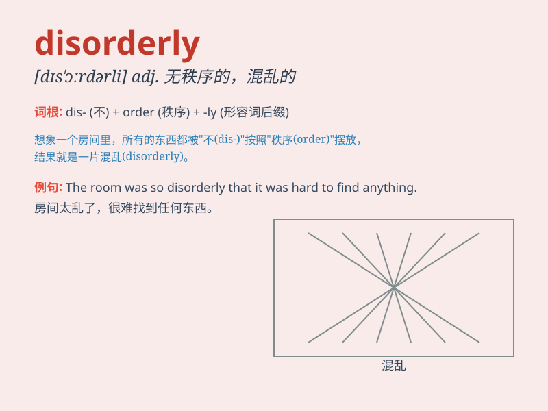

## disorderly

**英音:** _[dɪs\'ɔːdəlɪ]_ **美音:** _[dɪs\'ɔrdɚli]_

**译义:** *adj.混乱的*

### 短语

+ **disorderly conduct:** _扰乱社会治安的行为_

+ **disorderly crowd:** _混乱的人群_

+ **disorderly room:** _杂乱的房间_

+ **disorderly behavior:** _无序的行为；不守规矩的行为_

+ **disorderly queue:** _混乱的队列_

### 例句

#### 例句1

> **The room was in a disorderly state after the party.**

**中文翻译:** 聚会结束后，房间里一片凌乱。

**单词释义:** 凌乱的；杂乱的

#### 例句2

> **The disorderly crowd was dispersed by the police.**

**中文翻译:** 混乱的人群被警察驱散了。

**单词释义:** 混乱的；无秩序的

#### 例句3

> **His disorderly behavior got him into trouble.**

**中文翻译:** 他的无序行为给他带来了麻烦。

**单词释义:** 无序的；无条理的

### 背诵小故事

> A group of monkeys were playing in the zoo. They jumped around
disorderly, without any organized pattern. Some climbed trees, some
fought with each other. It was a disorderly scene.

**一群猴子在动物园里玩耍。它们到处乱跳，没有任何有序的模式。有的爬树，有的互相打斗。这是一片混乱无序的场景。**

### 图义

