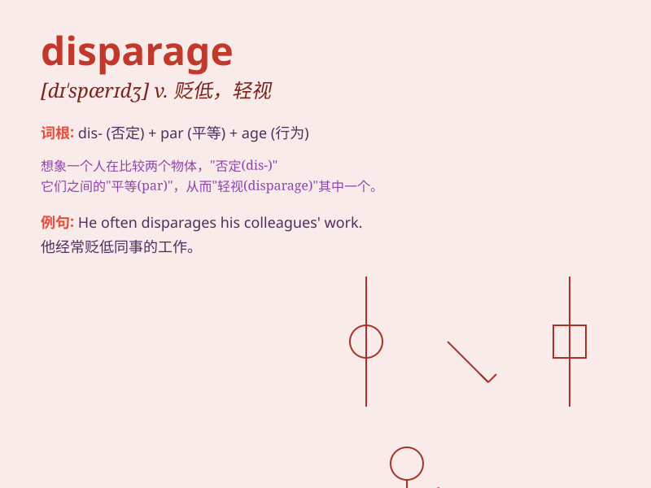

## disparage

**英音:** _[dɪ\'spærɪdʒ]_ **美音:** _[dɪ\'spærɪdʒ]_

**译义:** *vt.蔑视,贬损,使失去信誉*

### 短语

+ **disparage someone\'s achievements:** _贬低某人的成就_

+ **disparage the value:** _贬低价值_

+ **disparage publicly:** _公开贬低_

+ **disparage constantly:** _不断贬低_

+ **disparage unfairly:** _不公平地贬低_

### 例句

#### 例句1

> **He constantly disparages his colleagues\' work.**

**中文翻译:** 他不停地贬低他同事的工作。

**单词释义:** 贬低；诋毁

#### 例句2

> **You should not disparage her efforts to improve.**

**中文翻译:** 你不应该贬低她为改进所做的努力。

**单词释义:** 贬低；轻视

#### 例句3

> **Don\'t disparage the value of this book just because of its
cover.**

**中文翻译:** 不要仅仅因为这本书的封面就贬低它的价值。

**单词释义:** 贬低；轻视

### 背诵小故事

> A young artist was constantly disparaged by a jealous rival. But she
didn\'t give up and proved her talent. Disparage means to speak of or
treat someone or something in a way that shows a low opinion.

**一位年轻的艺术家不断被嫉妒的对手贬低。但她没有放弃，并证明了自己的才华。disparage
意思是以显示低评价的方式谈论或对待某人或某事。**

### 图义

