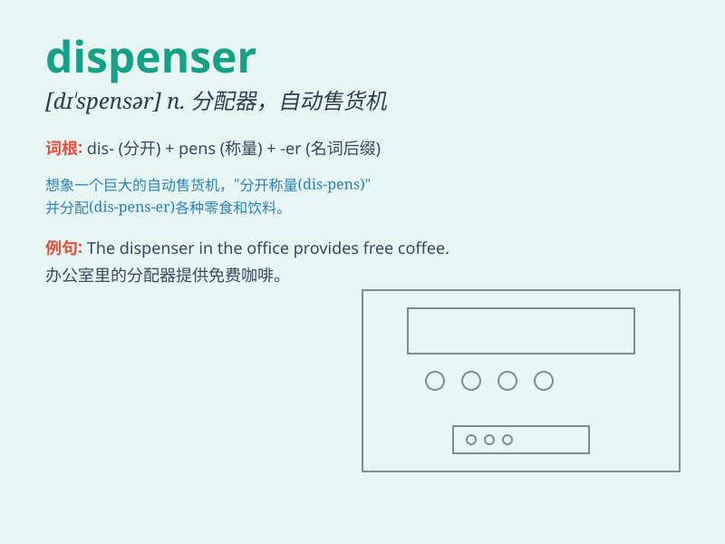

## dispenser

**英音:** _[dɪ\'spensə]_ **美音:** _[dɪ\'spɛnsɚ]_

**译义:** *n.药剂师,配药员,分配者,施与者,自动售货机*

### 短语

+ **soap dispenser:** _肥皂分配器_

+ **tissue dispenser:** _纸巾分发器_

+ **drink dispenser:** _饮料分配器_

+ **cash dispenser:** _自动提款机_

+ **ticket dispenser:** _售票机_

### 例句

#### 例句1

> **The dispenser in the bathroom is out of soap.**

**中文翻译:** 浴室里的分配器没有肥皂了。

**单词释义:** 分配器；自动售货机

#### 例句2

> **The water dispenser provides both hot and cold water.**

**中文翻译:** 这个饮水机提供热水和冷水。

**单词释义:** 饮水机；饮水器

#### 例句3

> **The hand sanitizer dispenser is located near the entrance.**

**中文翻译:** 洗手液分配器位于入口附近。

**单词释义:** 分配器；分发器

### 背诵小故事

> Imagine a magical machine that automatically gives out candies when
you press a button. That machine is a dispenser. It dispenses candies to
make kids happy. Just like that, a dispenser gives out or supplies
something.

**想象有一台神奇的机器，当你按下按钮时，它会自动分发糖果。那台机器就是一个分发器。它分发糖果让孩子们开心。就像这样，dispenser
指的是分发或供应某物的东西。**

### 图义

