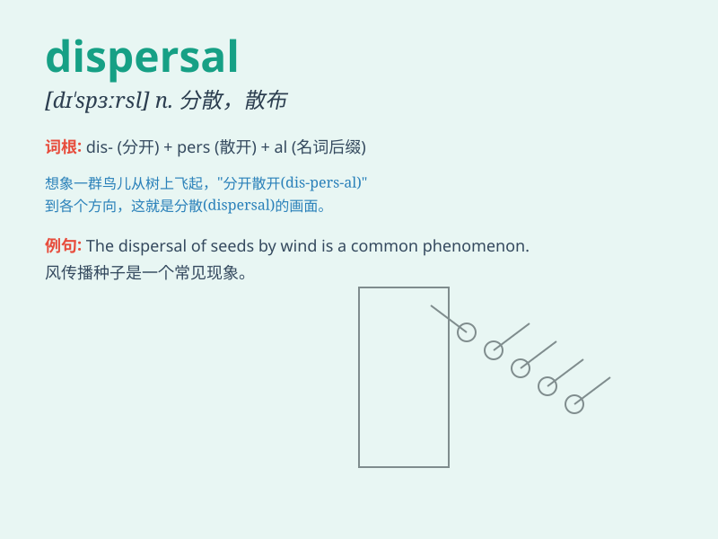

## dispersal

**英音:** _[dɪ\'spɜːsl]_ **美音:** _[dɪ\'spɝsl]_

**译义:** *n.散布,分散,消散,驱散,疏散*

### 短语

+ **seed dispersal:** _种子传播_

+ **dispersal area:** _分散区域_

+ **dispersal mechanism:** _分散机制_

+ **random dispersal:** _随机分散_

+ **wind dispersal:** _风传播_

### 例句

#### 例句1

> **The dispersal of the crowd was carried out peacefully by the
police.**

**中文翻译:** 人群的疏散由警方和平地进行。

**单词释义:** 疏散

#### 例句2

> **The wind aided the dispersal of the seeds.**

**中文翻译:** 风有助于种子的散播。

**单词释义:** 散播

#### 例句3

> **The company\'s dispersal of its assets led to financial
instability.**

**中文翻译:** 公司资产的分散导致了财务不稳定。

**单词释义:** 分散

### 背诵小故事

> A group of birds was happily living in a forest. But one day, a big
storm came, forcing the birds to disperse. They flew in different
directions to find new safe places. Dispersal means to spread or scatter
widely.

**一群鸟快乐地生活在森林里。但有一天，一场大风暴来临，迫使鸟儿分散。它们朝不同方向飞去寻找新的安全之地。Dispersal
意思是分散、散布。**

### 图义

