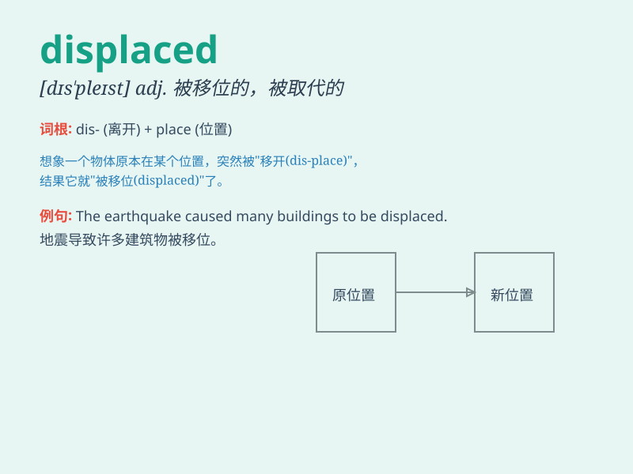

## displaced

**英音:** _[dɪsˈpleɪst]_ **美音:** _[dɪsˈpleɪst]_

**译义:**
*adj.被取代的；被移位的；失所的；n.移民；流离失所的人；v.使\...移位；使\...失去位置（displace的过去式和过去分词形式）*

### 短语

+ **displaced person:** _流离失所者；难民_

+ **displaced worker:** _失业工人；下岗工人_

+ **be displaced from:** _从\...被逐出；从\...被取代_

+ **displaced fracture:** _移位骨折_

+ **displaced aggression:** _转向攻击；替代性攻击_

### 例句

#### 例句1

> **The earthquake displaced thousands of people from their
homes.**

**中文翻译:** 地震使成千上万的人失去了家园。

**单词释义:** 使离开家园

#### 例句2

> **Workers in the factory were displaced by robots.**

**中文翻译:** 工厂里的工人被机器人取代了。

**单词释义:** 取代

#### 例句3

> **The refugees were displaced and in desperate need of help.**

**中文翻译:** 这些难民流离失所，急需帮助。

**单词释义:** 使流离失所

### 背诵小故事

> A group of people were displaced from their hometown because of a
huge flood. They had to find new places to live. It was a sad situation.
Remember, \'displaced\' means forced to leave your usual place.

**一群人因为一场巨大的洪水被迫离开了他们的家乡。他们不得不寻找新的居住地。这是一个悲伤的情况。记住，\'displaced\'意思是被迫离开通常的位置。**

### 图义

