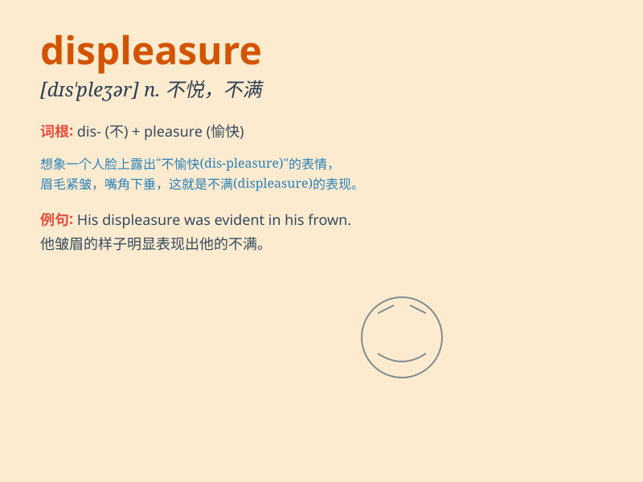

## displeasure

**英音:** _[dɪs\'pleʒə]_ **美音:** _[dɪs\'plɛʒɚ]_

**译义:** *n.不愉快,不满意*

### 短语

+ **express displeasure:** _表达不满_

+ **feel displeasure:** _感到不快_

+ **cause displeasure:** _引起不满_

+ **show displeasure:** _表现出不满_

+ **hide one\'s displeasure:** _隐藏某人的不满_

### 例句

#### 例句1

> **His expression showed his displeasure at the delay.**

**中文翻译:** 他的表情显示出他对延误感到不满。

**单词释义:** 不满；不悦

#### 例句2

> **She expressed her displeasure with a frown.**

**中文翻译:** 她皱着眉表示了她的不悦。

**单词释义:** 不悦；不高兴

#### 例句3

> **The boss\'s displeasure was obvious when he saw the poor
results.**

**中文翻译:** 当老板看到糟糕的结果时，他的不满显而易见。

**单词释义:** 不满；不快

### 背诵小故事

> A king was always in a good mood. But one day, his subjects didn\'t
follow his orders, which brought him displeasure. His frown and stern
look showed his dissatisfaction clearly.

**一位国王总是心情很好。但有一天，他的臣民没有听从他的命令，这给他带来了不快。他皱起的眉头和严厉的表情清楚地显示出他的不满。**

### 图义

