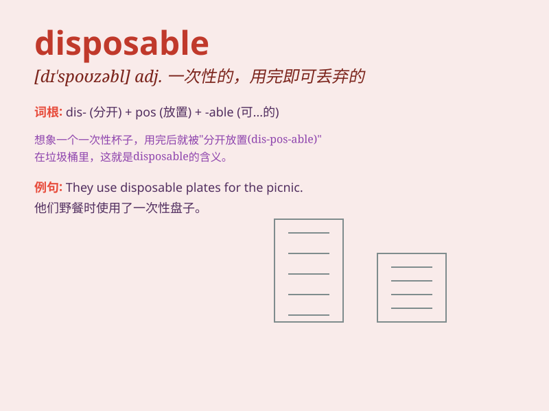

## disposable

**英音:** _[dɪ\'spəʊzəb(ə)l]_ **美音:** _[dɪ\'spozəbl]_

**译义:** *adj.可任意使用的*

### 短语

+ **disposable income:** _可支配收入_

+ **disposable chopsticks:** _一次性筷子_

+ **disposable diaper:** _一次性尿布_

+ **disposable camera:** _一次性相机_

+ **disposable syringe:** _一次性注射器_

### 例句

#### 例句1

> **Disposable income is what you have left after taxes and other
deductions.**

**中文翻译:** 可支配收入是指在扣除税款和其他扣除项后你所剩下的钱。

**单词释义:** 可自由支配的；可任意处理的

#### 例句2

> **The hospital uses disposable syringes to prevent the spread of
infection.**

**中文翻译:** 医院使用一次性注射器以防止感染的传播。

**单词释义:** 一次性的

#### 例句3

> **We should avoid using too many disposable products to protect the
environment.**

**中文翻译:** 我们应该避免使用太多一次性产品以保护环境。

**单词释义:** 用后即丢弃的；一次性的

### 背诵小故事

> A scientist was working on a new project and needed some disposable
test tubes. These tubes were designed to be used once and then thrown
away, making the experiments more efficient.

**一位科学家正在进行一个新项目，需要一些一次性的试管。这些试管被设计成使用一次然后就扔掉，使实验更高效。**

### 图义

