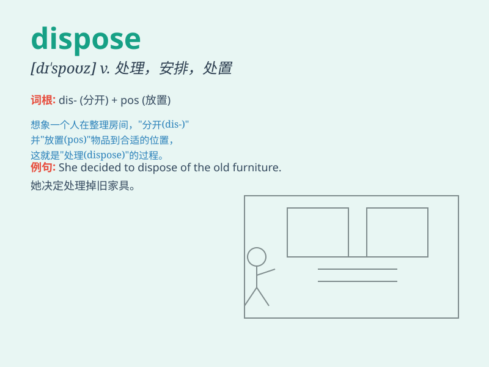

## dispose

**英音:** _[dɪ\'spəʊz]_ **美音:** _[dɪ\'spoz]_

**译义:** *v.处理,处置,部署vt.布置,安排,除去,使愿意*

### 短语

+ **dispose of:** _处理；解决；扔掉；除掉_

+ **dispose for:** _为\...安排；为\...布置_

+ **dispose towards:** _对\...的态度；对\...的倾向_

+ **be disposed to:** _倾向于；有意；愿意_

+ **dispose sb. to do sth.:** _使某人倾向于做某事_

### 例句

#### 例句1

> **The king disposed of his enemies.**

**中文翻译:** 国王除掉了他的敌人。

**单词释义:** 除掉；处理

#### 例句2

> **I must dispose of these old books.**

**中文翻译:** 我必须处理掉这些旧书。

**单词释义:** 处理；处置

#### 例句3

> **His charm disposes people to like him.**

**中文翻译:** 他的魅力使人们喜欢上他。

**单词释义:** 使倾向于；使有意于

### 背诵小故事

> A king needed to dispose of some old treasures. He carefully planned
and arranged the process. Finally, he successfully dealt with them.
Dispose means to get rid of or arrange something.

**一位国王需要处理一些旧宝藏。他仔细规划并安排了这个过程。最终，他成功地处置了它们。dispose
意思是处理；处置；安排**

### 图义

