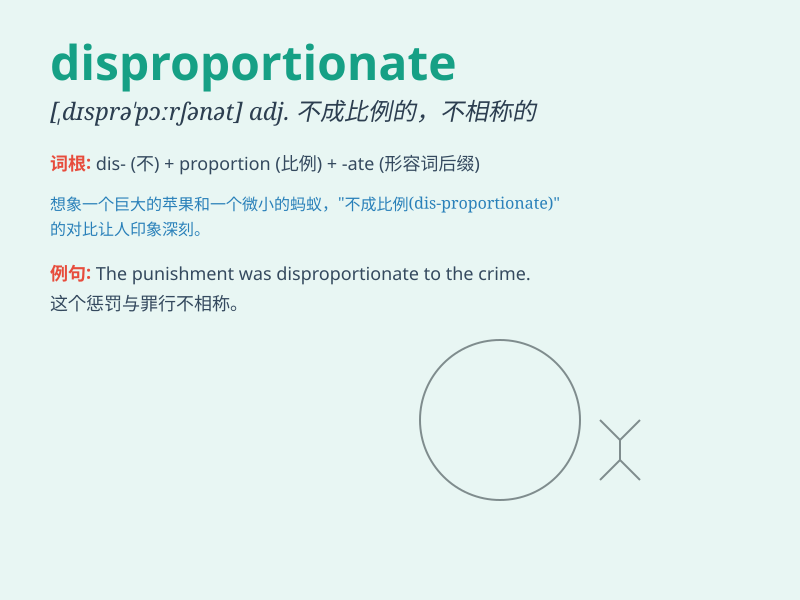

## disproportionate

**英音:** _[ˌdɪsprəˈpɔːrʃənət]_ **美音:**
_[ˌdɪsprəˈpɔːrʃənət]_

**译义:** *adj.不成比例的；不相称的；过度的*

### 短语

+ **disproportionate impact:** _不成比例的影响_

+ **disproportionate share:** _不成比例的份额_

+ **disproportionate burden:** _不成比例的负担_

+ **disproportionate advantage:** _不成比例的优势_

+ **disproportionate response:** _不成比例的反应_

### 例句

#### 例句1

> **The distribution of wealth in this society is
disproportionate.**

**中文翻译:** 这个社会的财富分配不均衡。

**单词释义:** 不均衡的；不成比例的

#### 例句2

> **The punishment was disproportionate to the crime committed.**

**中文翻译:** 这个惩罚与所犯罪行不成比例。

**单词释义:** 不成比例的

#### 例句3

> **There is a disproportionate number of men in top management
positions.**

**中文翻译:** 高层管理职位中男性的数量不成比例。

**单词释义:** 不成比例的

### 背诵小故事

> A king had a disproportionate number of jewels compared to his
subjects. The subjects worked hard but had few. This imbalance showed
the meaning of \'disproportionate\' - not proportionate or unequal in
size, amount, or degree.

**一位国王拥有的珠宝数量与他的臣民不成比例。臣民辛勤劳作却所得甚少。这种不平衡体现了\'disproportionate\'的意思------不成比例的，不均衡的，在规模、数量或程度上不平等。**

### 图义

