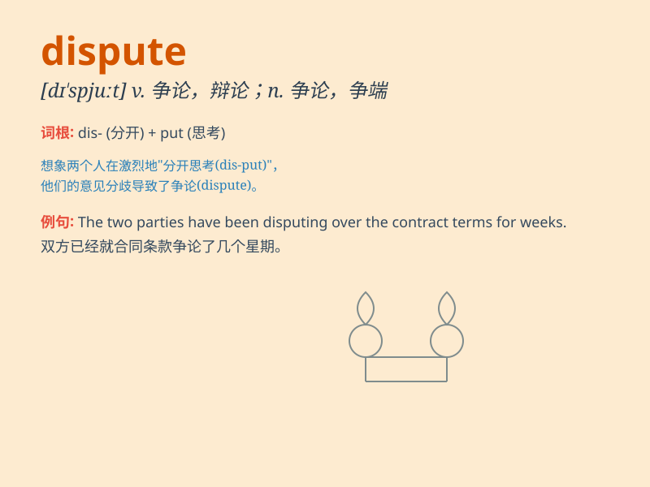

## dispute

**英音:** _[dɪ\'spjuːt; \'dɪspjuːt]_ **美音:**
_[\'dɪs\'pjʊt]_

**译义:**
*v.争论,辩论,怀疑,抗拒,阻止,争夺(土地,胜利等)n.争论,辩论,争吵*

### 短语

+ **in dispute:** _在争论中；处于争议中_

+ **dispute settlement:** _争端解决；争议解决_

+ **beyond dispute:** _无疑地；没有争论余地_

+ **trade dispute:** _贸易争端；商业纠纷_

+ **dispute resolution:** _纠纷解决；争议解决_

### 例句

#### 例句1

> **There was a dispute over the ownership of the land.**

**中文翻译:** 在这片土地的所有权问题上存在争议。

**单词释义:** 争议；争端

#### 例句2

> **They disputed the result of the election.**

**中文翻译:** 他们对选举结果提出异议。

**单词释义:** 对......提出质疑；争论

#### 例句3

> **The two countries are in dispute over fishing rights.**

**中文翻译:** 这两个国家在捕鱼权问题上存在争端。

**单词释义:** 争端；纠纷

### 背诵小故事

> Two friends were on a hiking trip. When they got lost, they had a
dispute about which way to go. One insisted on going left, the other
right. Finally, they used a map to solve the dispute.

**两个朋友在徒步旅行。当他们迷路时，对于走哪条路产生了争执。一个坚持往左，另一个坚持往右。最后，他们用地图解决了这场争端。**

### 图义

