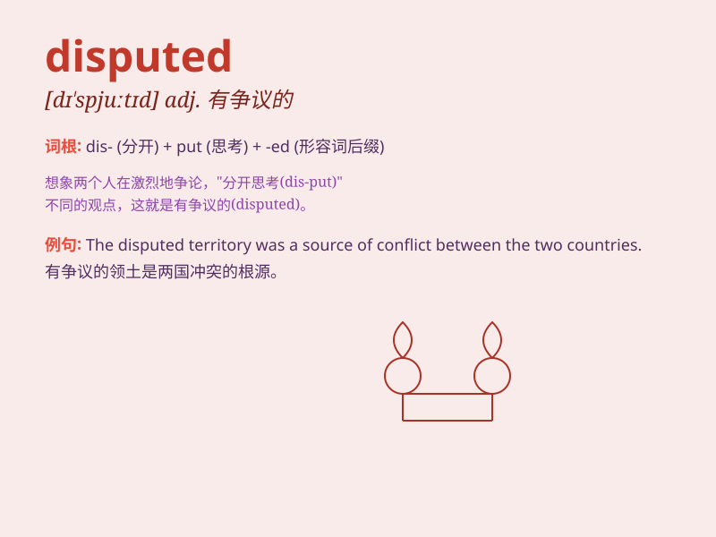

## disputed

**英音:** _[dɪˈspjuːtɪd]_ **美音:** _[dɪˈspjuːtɪd]_

**译义:** *v.争议 vbl.争议*

### 短语

+ **disputed territory:** _有争议的领土_

+ **disputed issue:** _有争议的问题_

+ **disputed claim:** _有争议的主张_

+ **disputed election:** _有争议的选举_

+ **disputed point:** _有争议的点_

### 例句

#### 例句1

> **The ownership of the land is disputed.**

**中文翻译:** 这片土地的所有权存在争议。

**单词释义:** 有争议的

#### 例句2

> **They disputed the result of the election.**

**中文翻译:** 他们对选举结果提出异议。

**单词释义:** 争论；对\...提出异议

#### 例句3

> **The disputed area is a source of constant conflict.**

**中文翻译:** 有争议的地区是冲突不断的根源。

**单词释义:** 有争议的

### 背诵小故事

> A group of explorers found a disputed treasure chest. Some said it
belonged to them, while others claimed it was for the local tribe. The
arguments over who owned it made the situation very disputed.

**一群探险家发现了一个有争议的宝箱。一些人说它属于他们，而另一些人则声称它属于当地部落。关于谁拥有它的争论使得情况变得非常有争议。**

### 图义

