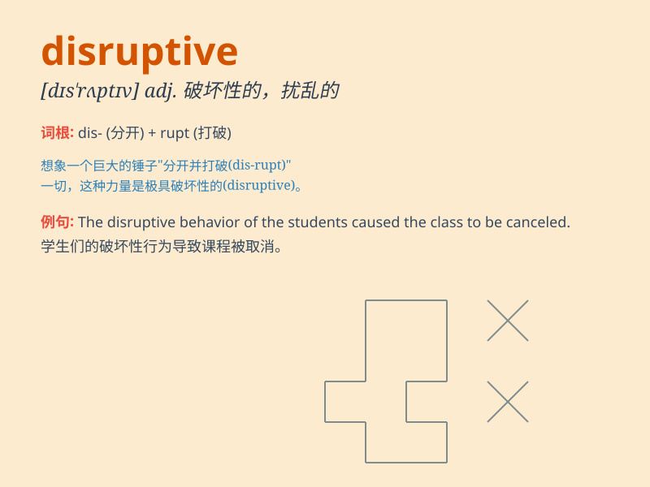

## disruptive

**英音:** _[dɪs\'rʌptɪv]_ **美音:** _[dɪs\'rʌptɪv]_

**译义:** *adj.使破裂的,分裂性的*

### 短语

+ **disruptive behavior:** _破坏性行为_

+ **disruptive innovation:** _颠覆性创新_

+ **disruptive technology:** _颠覆性技术_

+ **disruptive influence:** _破坏性影响_

+ **disruptive force:** _破坏力_

### 例句

#### 例句1

> **The disruptive child was constantly causing trouble in the
classroom.**

**中文翻译:** 这个捣乱的孩子在教室里不断惹麻烦。

**单词释义:** 捣乱的；制造混乱的

#### 例句2

> **The new technology has had a disruptive effect on the traditional
industry.**

**中文翻译:** 这项新技术对传统产业产生了颠覆性的影响。

**单词释义:** 颠覆性的；破坏性的

#### 例句3

> **His disruptive behavior at the meeting disrupted the
discussion.**

**中文翻译:** 他在会议上的破坏性行为扰乱了讨论。

**单词释义:** 破坏的；扰乱的

### 背诵小故事

> A group of kids were playing in the classroom. One of them was very
disruptive. He kept throwing things around and making a lot of noise.
The teacher was very angry.

**一群孩子在教室里玩耍。其中一个非常捣乱。他不停地乱扔东西并制造大量噪音。老师非常生气。**

### 图义

