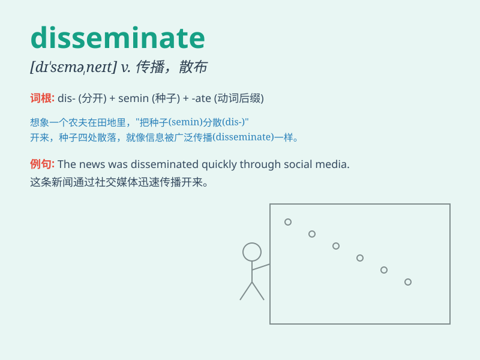

## disseminate

**英音:** _[dɪ\'semɪneɪt]_ **美音:** _[dɪ\'sɛmɪnet]_

**译义:** *v.散布*

### 短语

+ **disseminate information:** _传播信息_

+ **disseminate knowledge:** _传播知识_

+ **disseminate news:** _传播新闻_

+ **disseminate culture:** _传播文化_

+ **disseminate ideas:** _传播想法_

### 例句

#### 例句1

> **The Internet has greatly facilitated the dissemination of
information.**

**中文翻译:** 互联网极大地促进了信息的传播。

**单词释义:** 传播

#### 例句2

> **They are trying to disseminate their ideas to a wider
audience.**

**中文翻译:** 他们正试图将他们的想法传播给更广泛的受众。

**单词释义:** 传播；散布

#### 例句3

> **The scientist spent years disseminating knowledge about climate
change.**

**中文翻译:** 这位科学家花了多年时间传播有关气候变化的知识。

**单词释义:** 传播；宣传

### 背诵小故事

> A group of birds disseminate seeds as they fly over the fields. The
seeds fall everywhere, spreading far and wide. Just like how information
is disseminated to many people quickly.

**一群鸟在飞过田野时传播种子。种子到处掉落，广泛传播。就像信息迅速传播给很多人一样。**

### 图义

