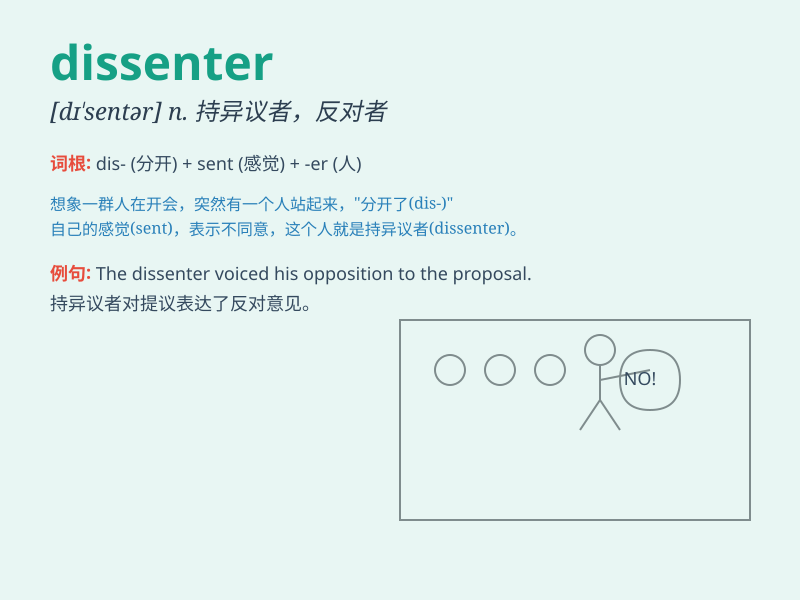

## dissenter

**英音:** _[dɪˈsentə(r)]_ **美音:** _[dɪˈsentər]_

**译义:** *n.不同意者,非国教派的人,反对者*

### 短语

+ **political dissenter:** _政治上的持不同政见者_

+ **religious dissenter:** _宗教上的异议者_

+ **outspoken dissenter:** _直言不讳的反对者_

+ **passive dissenter:** _消极的异议人士_

+ **notorious dissenter:** _声名狼藉的反对者_

### 例句

#### 例句1

> **The dissenter was vocal in expressing his opposition to the new
policy.**

**中文翻译:** 这位持不同意见者直言不讳地表达了他对新政策的反对。

**单词释义:** 持不同政见者；反对者

#### 例句2

> **There were a few dissenters in the crowd who refused to follow
the majority.**

**中文翻译:** 人群中有几个持异议者拒绝跟随大多数人。

**单词释义:** 持异议者

#### 例句3

> **The dissenter\'s views were not taken seriously by the
committee.**

**中文翻译:** 委员会没有认真对待这位反对者的观点。

**单词释义:** 反对者

### 背诵小故事

> In a small town, everyone agreed to a new rule. But one brave person,
named Tom, was a dissenter. He thought the rule was unfair and spoke out
against it. His courage made others start to think again.

**在一个小镇上，所有人都同意一项新规定。但有一个勇敢的人，叫汤姆，是个持异议者。他认为这个规定不公平，并公开表示反对。他的勇气让其他人重新思考。**

### 图义

