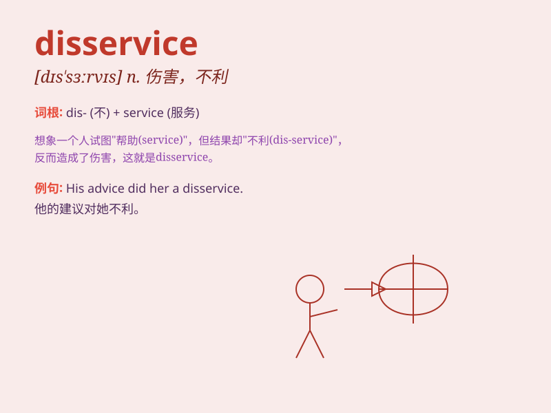

## disservice

**英音:** _[dɪ(s)\'sɜːvɪs]_ **美音:** _[dɪs\'sɝvɪs]_

**译义:** *n.伤害,虐待,不亲切的行为*

### 短语

+ **do a disservice:** _损害；帮倒忙_

+ **render a disservice:** _造成损害；帮倒忙_

+ **be a disservice to:** _对\...有害；对\...不利_

+ **commit a disservice:** _做出有害的事_

+ **inflict a disservice:** _施加损害_

### 例句

#### 例句1

> **Your actions have done a disservice to the entire team.**

**中文翻译:** 你的行为对整个团队造成了损害。

**单词释义:** 损害；伤害；危害

#### 例句2

> **He did the company a disservice by revealing confidential
information.**

**中文翻译:** 他泄露机密信息，给公司造成了损害。

**单词释义:** 损害；危害

#### 例句3

> **To spread rumors about her is to do her a great disservice.**

**中文翻译:** 散布关于她的谣言是对她极大的伤害。

**单词释义:** 伤害；损害

### 背诵小故事

> A student always came late to class, causing a disservice to the
whole learning atmosphere. The teacher was very angry. This behavior not
only affected himself but also brought negative influence to others.

**一个学生总是上课迟到，给整个学习氛围造成了损害。老师非常生气。这种行为不仅影响了他自己，也给其他人带来了负面影响。**

### 图义

