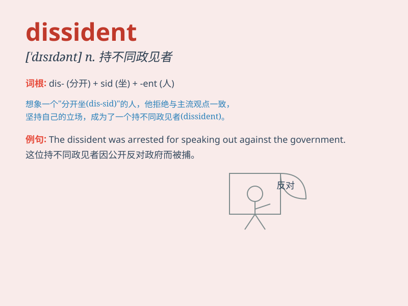

## dissident

**英音:** _[\'dɪsɪd(ə)nt]_ **美音:** _[\'dɪsɪdənt]_

**译义:** *n.持不同政见者*

### 短语

+ **political dissident:** _政治异议人士_

+ **dissident voice:** _不同政见的声音_

+ **dissident movement:** _持不同政见者的运动_

+ **dissident opinion:** _异议观点_

+ **dissident group:** _持不同政见的团体_

### 例句

#### 例句1

> **The dissident was arrested for expressing his political
views.**

**中文翻译:** 这位持不同政见者因表达他的政治观点而被捕。

**单词释义:** 持不同政见者

#### 例句2

> **The government was accused of suppressing dissidents.**

**中文翻译:** 政府被指控镇压持不同政见者。

**单词释义:** 持不同政见者

#### 例句3

> **He has always been a vocal dissident within the party.**

**中文翻译:** 他在党内一直是直言不讳的持不同政见者。

**单词释义:** 持不同政见者

### 背诵小故事

> A brave journalist was considered a dissident because he exposed the
truth that the government didn\'t want to be known. People respected him
for his courage to speak out against injustice.

**一位勇敢的记者因揭露政府不想为人所知的真相而被视为持不同政见者。人们尊敬他敢于直言反对不公正的勇气。**

### 图义

