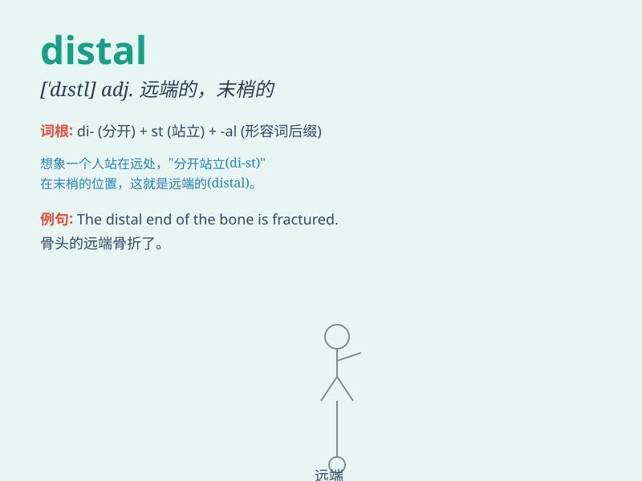

## distal

**英音:** _[\'dɪst(ə)l]_ **美音:** _[\'dɪstl]_

**译义:** *adj.末梢的*

### 短语

+ **distal end:** _远端_

+ **distal tubule:** _远曲小管_

+ **distal phalanx:** _远节指（趾）骨_

+ **distal convoluted tubule:** _远曲小管_

+ **distal portion:** _远端部分_

### 例句

#### 例句1

> **The injury was located at the distal end of the bone.**

**中文翻译:** 损伤位于骨头的远端。

**单词释义:** 远端的

#### 例句2

> **The distal part of the river is less polluted.**

**中文翻译:** 这条河的远端污染较轻。

**单词释义:** 远端的

#### 例句3

> **The doctor examined the patient\'s distal extremities.**

**中文翻译:** 医生检查了病人的远端肢体。

**单词释义:** 远端的

### 背诵小故事

> 想象一个医生在解释人体结构，他指着远离身体中心的肢体部位说：'This
part is distal.' （这个部位是远端的。） 这样就能记住 distal
表示远离中心的、末梢的意思。

**想象一位医生指着远离身体中心的肢体部位说'这个部位是远端的'，以此记住
distal 意为远离中心的、末梢的**

### 图义

