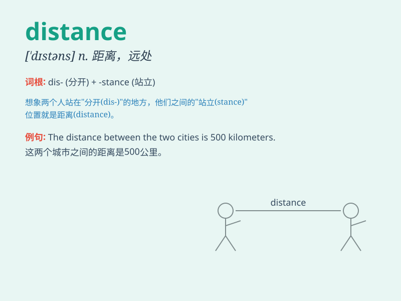

## distance

**英音:** _[ˈdɪstəns]_ **美音:** _[\'dɪstəns]_

**译义:**
*n.距离,远离,一长段时间,远方,远景,遥远,(时间的)间隔,(时日的)经过*

### 短语

+ **long distance:** _长距离_

+ **short distance:** _短距离_

+ **distance learning:** _远程教育_

+ **distance education:** _远程教育_

+ **keep a distance:** _保持距离_

### 例句

#### 例句1

> **The distance between the two cities is about 500 kilometers.**

**中文翻译:** 这两个城市之间的距离大约是 500 公里。

**单词释义:** 距离

#### 例句2

> **She kept her distance from the dangerous dog.**

**中文翻译:** 她与那只危险的狗保持距离。

**单词释义:** 距离；疏远

#### 例句3

> **It\'s a long distance call. You need to pay more.**

**中文翻译:** 这是长途电话。你需要多付费。

**单词释义:** 长途

### 背诵小故事

> One day, Tom had to walk a long distance to reach his friend\'s
house. He felt very tired but finally made it. The distance was so far
that he remembered it well.

**一天，汤姆不得不走很长一段距离去他朋友家。他感到非常累但最终到达了。这段距离如此之远，以至于他记得很清楚。**

### 图义

