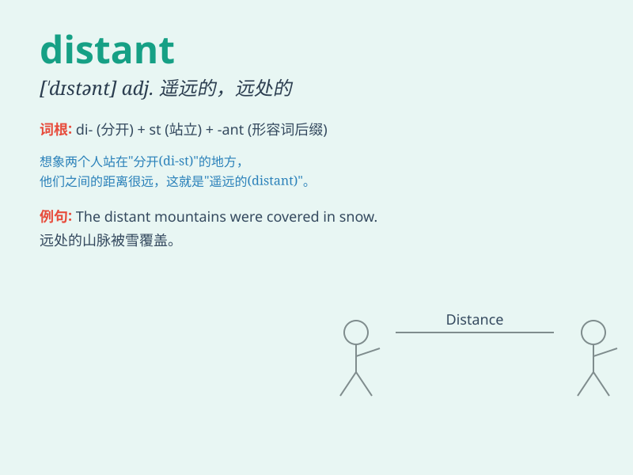

## distant

**英音:** _[\'dɪst(ə)nt]_ **美音:** _[\'dɪstənt]_

**译义:** *adj.远的,关系远的(亲戚),疏远的,间隔的,冷漠的*

### 短语

+ **distant past:** _遥远的过去_

+ **distant relative:** _远亲_

+ **distant land:** _遥远的国度_

+ **distant look:** _冷漠的表情；冷淡的神色_

+ **distant future:** _遥远的未来_

### 例句

#### 例句1

> **The stars look distant from the earth.**

**中文翻译:** 星星从地球上看起来很遥远。

**单词释义:** 遥远的

#### 例句2

> **He is a distant cousin of mine.**

**中文翻译:** 他是我的远房表亲。

**单词释义:** 远亲的

#### 例句3

> **She gave him a distant smile.**

**中文翻译:** 她给了他一个冷淡的微笑。

**单词释义:** 冷淡的

### 背诵小故事

> A man was lost in a forest. He saw a distant light and hoped it was a
way out. He walked towards it, thinking it was his salvation. But it was
still very far away. \'Distant\' means far away.

**一个男人在森林里迷路了。他看到远处有一束光，希望那是出路。他朝着它走去，认为那是他的救星。但它仍然很远。\'distant\'意思是遥远的。**

### 图义

