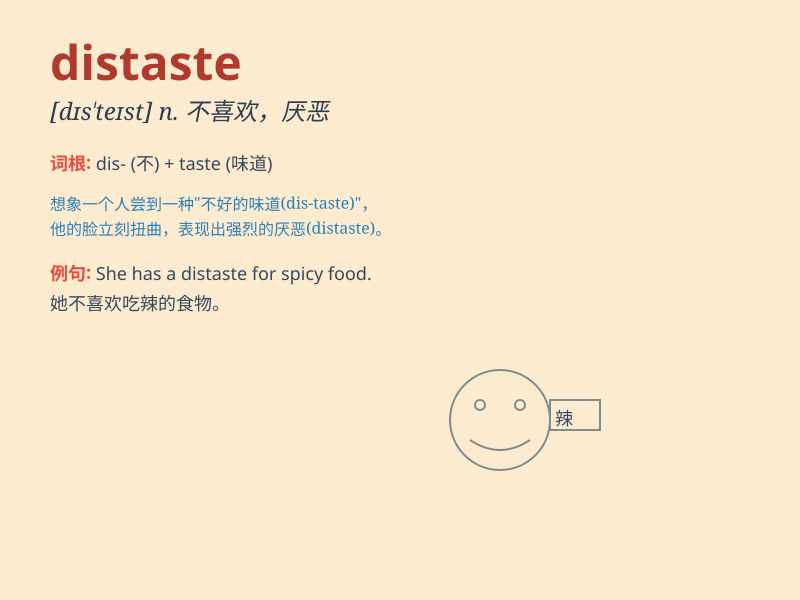

## distaste

**英音:** _[dɪs\'teɪst]_ **美音:** _[dɪs\'test]_

**译义:** *n.讨厌,嫌恶*

### 短语

+ **have a distaste for:** _厌恶，不喜欢_

+ **in distaste:** _厌恶地_

+ **feel distaste:** _感到厌恶_

+ **distaste of something:** _对某事的厌恶_

+ **show distaste:** _表现出厌恶_

### 例句

#### 例句1

> **I have a distaste for spicy food.**

**中文翻译:** 我不喜欢辣的食物。

**单词释义:** 厌恶，反感

#### 例句2

> **His actions showed his distaste for the new policy.**

**中文翻译:** 他的行动表明了他对新政策的反感。

**单词释义:** 讨厌，不喜欢

#### 例句3

> **She looked at him with distaste when he made that joke.**

**中文翻译:** 当他开那个玩笑时，她厌恶地看着他。

**单词释义:** 厌恶，嫌恶

### 背诵小故事

> A girl named Lily had a distaste for broccoli. Every time she saw it
on her plate, she frowned. But one day, she tried it and discovered it
wasn\'t so bad. Now, she no longer has that strong distaste.

**一个叫莉莉的女孩非常讨厌西兰花。每次看到盘子里有它，她就皱眉。但有一天，她尝试了一下，发现也没那么糟。现在，她不再那么讨厌了。**

### 图义

