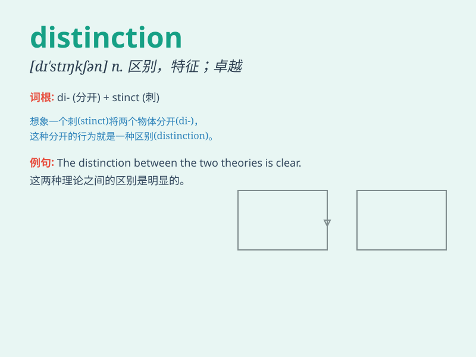

## distinction

**英音:** _[dɪ\'stɪŋ(k)ʃ(ə)n]_ **美音:**
_[dɪ\'stɪŋkʃən]_

**译义:** *n.区别,差别,级别,特性,声望,显赫*

### 短语

+ **class distinction:** _阶级差别_

+ **make a distinction:** _加以区分_

+ **without distinction:** _无差别地；一视同仁地_

+ **fine distinction:** _细微的差别_

+ **distinction between:** _\...\...之间的区别_

### 例句

#### 例句1

> **She has the distinction of being the first woman to win the Nobel
Prize in Literature.**

**中文翻译:** 她拥有作为首位获得诺贝尔文学奖的女性的殊荣。

**单词释义:** 殊荣；荣誉

#### 例句2

> **There is a clear distinction between right and wrong.**

**中文翻译:** 对与错之间有明显的区别。

**单词释义:** 区别；差别

#### 例句3

> **His style of writing has a certain distinction.**

**中文翻译:** 他的写作风格有一定的特色。

**单词释义:** 特色；独特之处

### 背诵小故事

> A young artist struggled to make a name for himself. But with his
unique style, he gained distinction. People could easily recognize his
works among others. Finally, his art brought him great fame and success.

**一位年轻的艺术家努力想成名。但凭借其独特的风格，他获得了与众不同之处。人们能轻易地在其他作品中认出他的作品。最终，他的艺术为他带来了巨大的声誉和成功。**

### 图义

