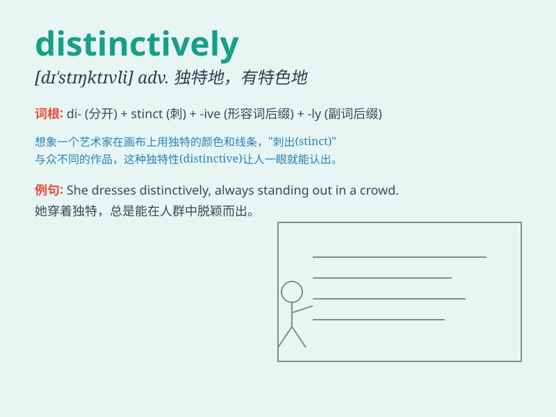

## distinctively

**英音:** _[dɪ\'stɪŋktɪvli]_ **美音:**
_[dɪ\'stɪŋktɪvli]_

**译义:** *adv.区别地,特殊地*

### 短语

+ **distinctively different:** _明显不同_

+ **distinctively marked:** _有明显标记的_

+ **distinctively styled:** _风格独特_

+ **distinctively flavored:** _味道独特_

+ **distinctively dressed:** _穿着独特_

### 例句

#### 例句1

> **The new perfume has a distinctively floral scent.**

**中文翻译:** 这款新香水有一种独特的花香。

**单词释义:** 独特地；特别地

#### 例句2

> **She dressed distinctively in a bright red coat.**

**中文翻译:** 她穿着一件鲜红的外套，打扮得很特别。

**单词释义:** 与众不同地；有特色地

#### 例句3

> **The artist\'s style is distinctively modern.**

**中文翻译:** 这位艺术家的风格明显很现代。

**单词释义:** 明显地；显著地

### 背诵小故事

> A little rabbit had a distinctively marked tail. It was different
from others and made it stand out in the forest. This tail helped its
friends find it easily. \'Distinctively\' means in a way that is easily
noticed and different.

**一只小兔子有一条特征明显的尾巴。它与其他兔子的尾巴不同，在森林里很突出。这条尾巴让它的朋友们很容易找到它。\'distinctively\'意思是以容易被注意到和与众不同的方式。**

### 图义

