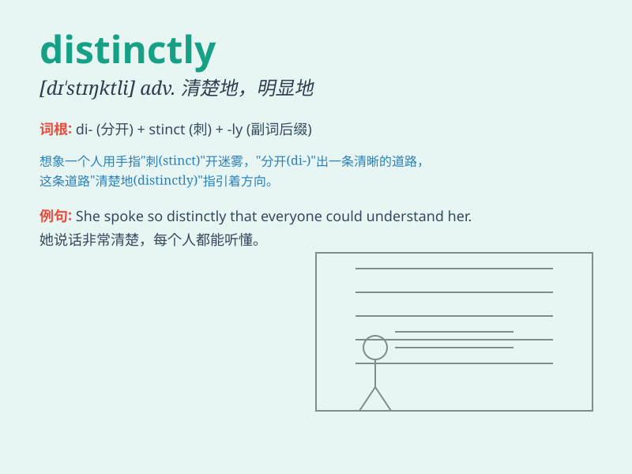

## distinctly

**英音:** _[dɪ\'stɪŋ(k)tlɪ]_ **美音:** _[dɪ\'stɪŋktli]_

**译义:** *adv.清楚地,显然*

### 短语

+ **distinctly different:** _明显不同_

+ **distinctly remember:** _清楚地记得_

+ **distinctly visible:** _清晰可见_

+ **distinctly audible:** _清晰可闻_

+ **distinctly stated:** _明确陈述_

### 例句

#### 例句1

> **I distinctly remember meeting her at the party.**

**中文翻译:** 我清楚地记得在聚会上见过她。

**单词释义:** 清楚地

#### 例句2

> **He spoke distinctly, so everyone could understand him.**

**中文翻译:** 他说话清晰，所以每个人都能听懂他。

**单词释义:** 清晰地

#### 例句3

> **The two ideas are distinctly different.**

**中文翻译:** 这两个想法截然不同。

**单词释义:** 明显地

### 背诵小故事

> Once upon a time, in a foggy forest, there were two similar paths.
But one was distinctly marked with colorful flags, making it easy to
follow. This clearly marked path was distinct from the other.

**从前，在一个雾气弥漫的森林里，有两条相似的小路。但其中一条明显地用彩色旗子做了标记，很容易跟随。这条有明显标记的路与另一条截然不同。**

### 图义

