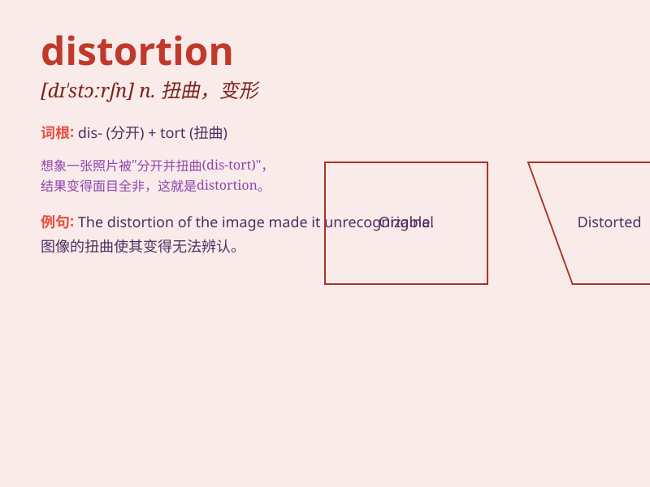

## distortion

**英音:** _[dɪ\'stɔːʃ(ə)n]_ **美音:** _[dɪs\'tɔrʃən]_

**译义:** *n.扭曲,变形,曲解,失真*

### 短语

+ **audio distortion:** _音频失真_

+ **distortion effect:** _失真效果_

+ **optical distortion:** _光学失真_

+ **distortion of facts:** _事实的歪曲_

+ **geometric distortion:** _几何失真_

### 例句

#### 例句1

> **The distortion in the mirror made her reflection look
strange.**

**中文翻译:** 镜子中的扭曲使她的倒影看起来很奇怪。

**单词释义:** 扭曲；变形

#### 例句2

> **The audio signal suffered from distortion during
transmission.**

**中文翻译:** 音频信号在传输过程中受到了失真。

**单词释义:** 失真；畸变

#### 例句3

> **His account of the event was full of distortion and
exaggeration.**

**中文翻译:** 他对这件事的叙述充满了歪曲和夸张。

**单词释义:** 歪曲；曲解

### 背诵小故事

> A musician was very angry when he heard the distortion of his
beautiful melody. The sound was so bad that it completely changed the
charm of the music. This bad change is like the meaning of
\'distortion\'.

**一位音乐家听到他优美旋律的失真时非常生气。声音太糟糕了，完全改变了音乐的魅力。这种不好的变化就像'distortion'这个词的意思。**

### 图义

