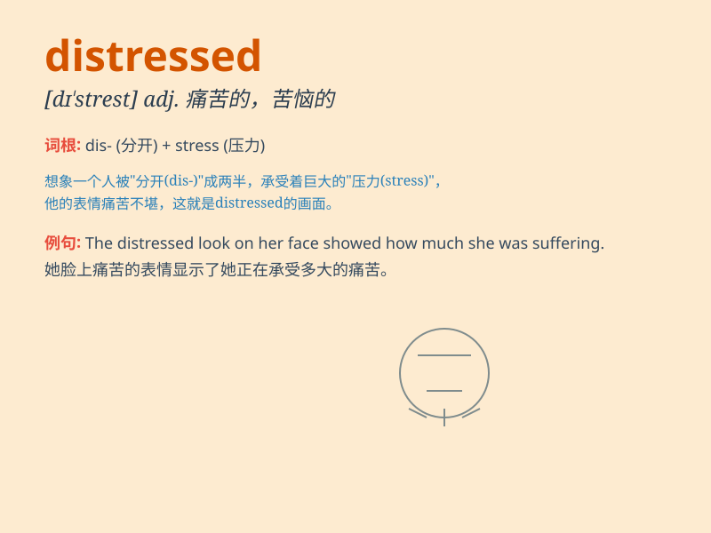

## distressed

**英音:** _[dɪ\'strest]_ **美音:** _[dɪ\'strɛst]_

**译义:** *adj.哀伤的*

### 短语

+ **distressed jeans:** _做旧牛仔裤_

+ **distressed property:** _不良资产_

+ **distressed look:** _忧愁的表情_

+ **distressed area:** _贫困地区_

+ **distressed furniture:** _仿古家具_

### 例句

#### 例句1

> **She looked distressed when she heard the bad news.**

**中文翻译:** 当她听到这个坏消息时，她看起来很苦恼。

**单词释义:** 苦恼的；忧虑的

#### 例句2

> **The distressed dog was wandering the streets alone.**

**中文翻译:** 这只痛苦的狗独自在街头游荡。

**单词释义:** 痛苦的；受难的

#### 例句3

> **He bought the distressed property at a low price.**

**中文翻译:** 他以低价购买了这处陷入困境的房产。

**单词释义:** 陷入困境的；处于危难的

### 背诵小故事

> A poor artist was constantly distressed. His paintings didn\'t sell,
debts piled up. But he didn\'t give up. Eventually, his talent was
recognized, and his life changed. Remember, \'distressed\' means very
worried and unhappy.

**一位可怜的艺术家一直很苦恼。他的画卖不出去，债务堆积如山。但他没有放弃。最终，他的才华得到认可，生活改变了。记住，\'distressed\'意思是非常担忧和不开心。**

### 图义

