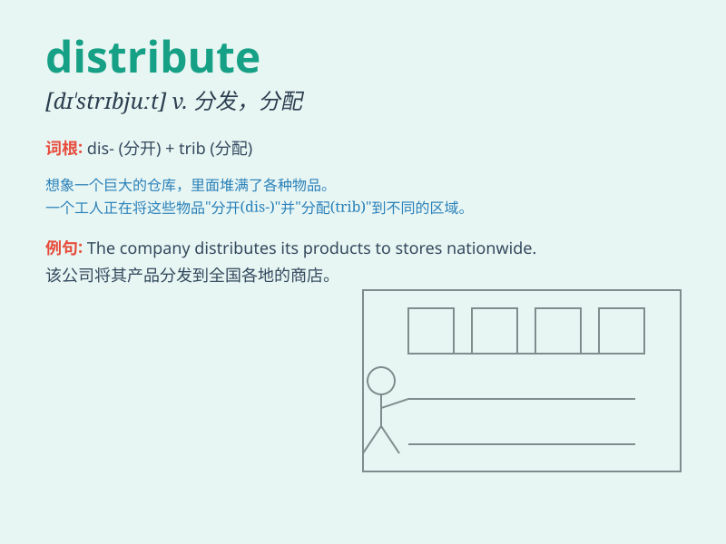

## distribute

**英音:** _[dɪ\'strɪbjuːt; \'dɪstrɪbjuːt]_ **美音:**
_[dɪ\'strɪbjut]_

**译义:** *vt.分发,分配,散布,分布,分类,分区v.分发*

### 短语

+ **distribute evenly:** _均匀分布_

+ **distribute widely:** _广泛分发_

+ **distribute randomly:** _随机分配_

+ **distribute among:** _在\...\...之间分配_

+ **distribute to:** _分发给_

### 例句

#### 例句1

> **The company will distribute the new products to various
stores.**

**中文翻译:** 这家公司将把新产品分发到各个商店。

**单词释义:** 分发

#### 例句2

> **The teacher distributed the test papers to the students.**

**中文翻译:** 老师把试卷分发给学生。

**单词释义:** 分发

#### 例句3

> **The machine is used to distribute seeds evenly in the field.**

**中文翻译:** 这台机器用于在田地里均匀地分配种子。

**单词释义:** 分配

### 背诵小故事

> A kind fairy was in charge of distributing gifts to children. She
flew around, carefully giving each child the right present. The act of
her giving out gifts is like \'distribute\'.

**一位善良的仙女负责给孩子们分发礼物。她到处飞，仔细地给每个孩子合适的礼物。她送礼物的这个行为就像是'分发'。**

### 图义

