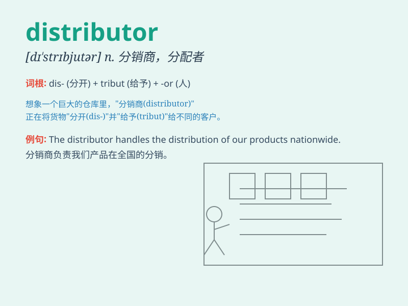

## distributor

**英音:** _[dɪ\'strɪbjʊtə]_ **美音:** _[dɪ\'strɪbjətɚ]_

**译义:** *n.发行人*

### 短语

+ **wholesale distributor:** _批发商_

+ **authorized distributor:** _授权经销商_

+ **local distributor:** _当地经销商_

+ **electrical distributor:** _电气分销商_

+ **fuel distributor:** _燃油分配器_

### 例句

#### 例句1

> **The distributor supplies products to various retailers.**

**中文翻译:** 这个经销商向各个零售商供应产品。

**单词释义:** 经销商

#### 例句2

> **We need to find a reliable distributor for our new line of
products.**

**中文翻译:** 我们需要为我们的新产品线找到一个可靠的分销商。

**单词释义:** 分销商

#### 例句3

> **The distributor of electricity was responsible for the power
outage.**

**中文翻译:** 电力的配送商对停电负责。

**单词释义:** 配送商

### 背诵小故事

>
想象一个小镇，有个勤劳的人负责把各种新鲜水果分发到各个商店，他就是水果的
distributor。他开着车，准确无误地把水果送到每个需要的地方，确保大家都能买到。

**想象一个小镇中负责把水果分发到各个商店的人，以此来记住distributor（分销商；经销商）这个单词**

### 图义

