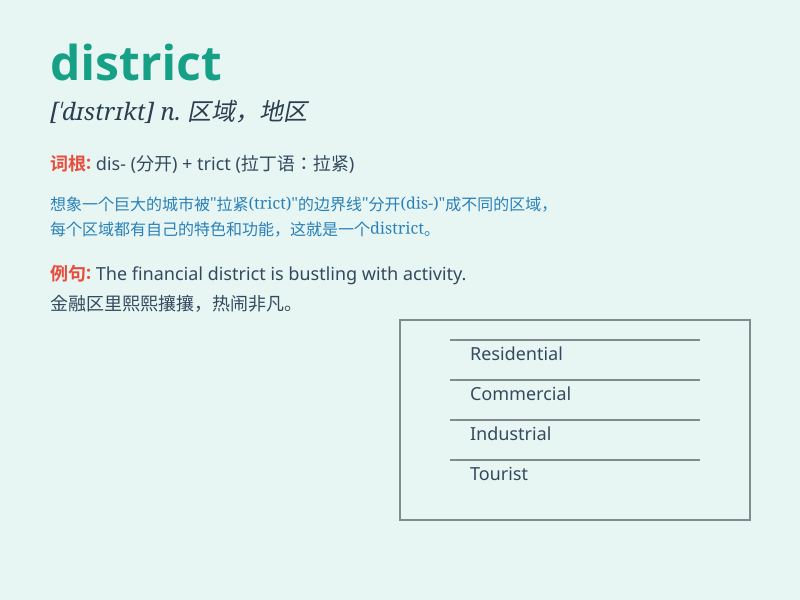

## district

**英音:** _[\'dɪstrɪkt]_ **美音:** _[\'dɪstrɪkt]_

**译义:** *n.区域,地方,管区,行政区,(美国各州的)众议院选区*

### 短语

+ **commercial district:** _商业区_

+ **residential district:** _住宅区_

+ **school district:** _学区_

+ **industrial district:** _工业区_

+ **urban district:** _市区_

### 例句

#### 例句1

> **The district is known for its beautiful parks.**

**中文翻译:** 这个地区以其美丽的公园而闻名。

**单词释义:** 地区

#### 例句2

> **She works in the business district of the city.**

**中文翻译:** 她在城市的商业区工作。

**单词释义:** 区；区域

#### 例句3

> **The school is located in a quiet district.**

**中文翻译:** 这所学校位于一个安静的区域。

**单词释义:** 区域；行政区

### 背诵小故事

> In a big city, there was a special area called the \'district\'. It
had its own schools, parks, and shops. People in this district lived
happily and knew each other well. It was like a small world of its own.

**在一个大城市里，有一个特殊的区域被称为"区"。它有自己的学校、公园和商店。这个区里的人们生活得很幸福，彼此也很熟悉。它就像一个属于自己的小世界。**

### 图义

