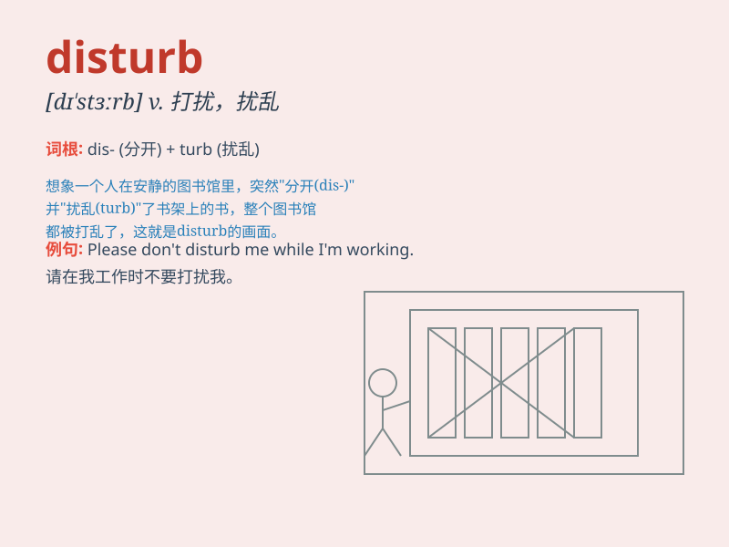

## disturb

**英音:** _[dɪ\'stɜːb]_ **美音:** _[dɪ\'stɝb]_

**译义:** *vt.弄乱,打乱,打扰,扰乱v.扰乱*

### 短语

+ **disturb the peace:** _扰乱治安_

+ **disturb sb\'s sleep:** _打扰某人睡眠_

+ **disturb the balance:** _打破平衡_

+ **disturb the mind:** _扰乱思绪_

+ **disturb the water:** _搅动水_

### 例句

#### 例句1

> **Don\'t disturb me while I\'m working.**

**中文翻译:** 我工作的时候别打扰我。

**单词释义:** 打扰

#### 例句2

> **The noise outside disturbed my sleep.**

**中文翻译:** 外面的噪音打扰了我的睡眠。

**单词释义:** 干扰，妨碍

#### 例句3

> **I\'m sorry to disturb your peace.**

**中文翻译:** 很抱歉打扰了你的安宁。

**单词释义:** 扰乱

### 背诵小故事

> One day, I was concentrating on my homework when my little brother
came in and made a lot of noise. His behavior disturbed my study. I was
very angry and told him to be quiet.

**有一天，我正在专心做作业，这时我的弟弟进来制造了很多噪音。他的行为打扰了我的学习。我非常生气并让他安静。**

### 图义

