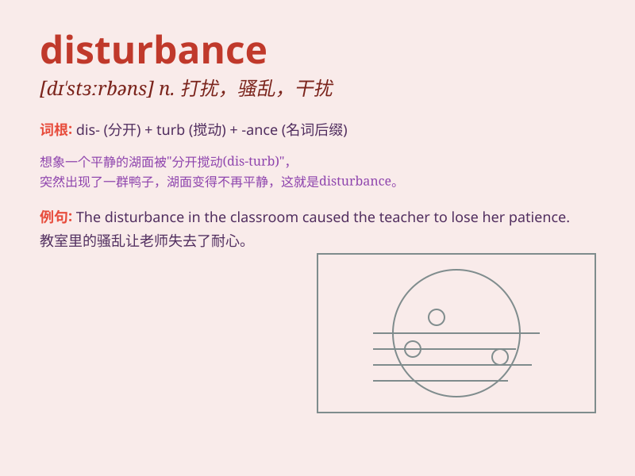

## disturbance

**英音:** _[dɪ\'stɜːb(ə)ns]_ **美音:** _[dɪ\'stɝbəns]_

**译义:** *n.骚动,动乱,打扰,干扰,骚乱,搅动*

### 短语

+ **emotional disturbance:** _情绪困扰_

+ **environmental disturbance:** _环境干扰_

+ **social disturbance:** _社会动乱_

+ **minor disturbance:** _轻微干扰_

+ **traffic disturbance:** _交通干扰_

### 例句

#### 例句1

> **The disturbance in the classroom made the teacher angry.**

**中文翻译:** 教室里的骚乱让老师生气了。

**单词释义:** 骚乱；动乱

#### 例句2

> **The construction work caused a lot of disturbance to the
residents.**

**中文翻译:** 建筑工程给居民带来了很多干扰。

**单词释义:** 干扰；打扰

#### 例句3

> **The police were called to deal with the disturbance at the
party.**

**中文翻译:** 警察被叫来处理聚会上的骚乱。

**单词释义:** 骚乱；混乱

### 背诵小故事

> A group of monkeys were playing in the forest. Suddenly, a loud noise
from a construction site nearby caused a disturbance. The monkeys got
scared and scattered. This unexpected event was a clear example of a
disturbance.

**一群猴子正在森林里玩耍。突然，附近建筑工地传来的巨大噪音引起了一阵骚乱。猴子们受到惊吓，四处逃窜。这个意外事件就是骚乱的一个明显例子。**

### 图义

