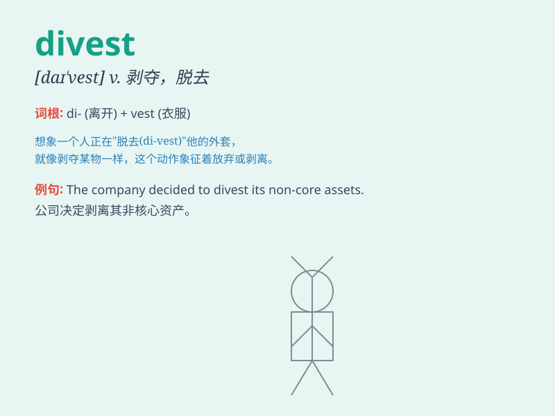

## divest

**英音:** _[daɪ\'vest; dɪ-]_ **美音:** _[daɪ\'vɛst]_

**译义:** *v.剥夺*

### 短语

+ **divest oneself of:** _摆脱；丢弃；脱去_

+ **divest assets:** _剥离资产_

+ **divest control:** _放弃控制_

+ **divest ownership:** _出让所有权_

+ **divest property:** _出让财产_

### 例句

#### 例句1

> **The company decided to divest its non-core businesses.**

**中文翻译:** 公司决定剥离非核心业务。

**单词释义:** 剥离，出售（部分业务或资产）

#### 例句2

> **He divested himself of his jacket as it was too warm.**

**中文翻译:** 由于天气太热，他脱掉了外套。

**单词释义:** 脱去（衣服）

#### 例句3

> **She was forced to divest her shares in the company.**

**中文翻译:** 她被迫出售她在公司的股份。

**单词释义:** 出售（股份）

### 背诵小故事

> A rich man decided to divest himself of most of his possessions. He
felt they were weighing him down. By divesting, he found freedom and
simplicity.

**一个富人决定剥离他的大部分财产。他觉得这些财产让他不堪重负。通过剥离，他找到了自由和简单。**

### 图义

