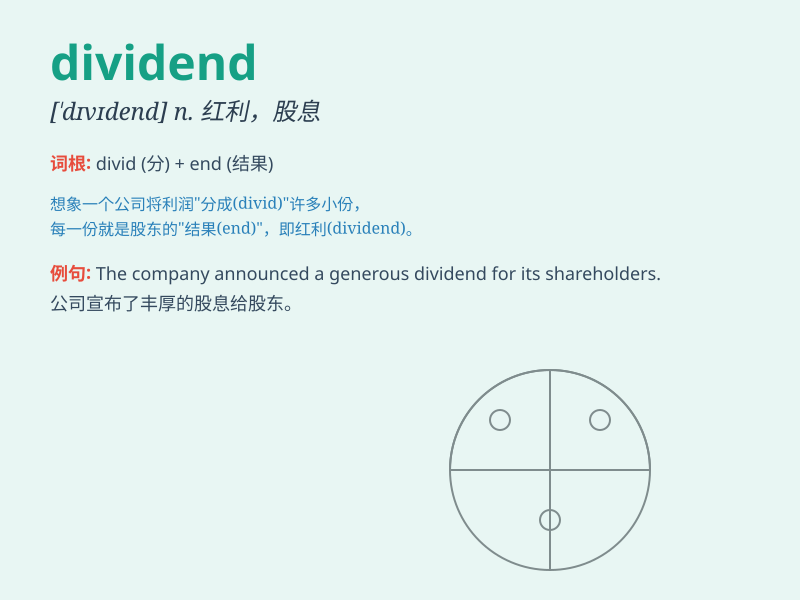

## dividend

**英音:** _[\'dɪvɪdend]_ **美音:** _[\'dɪvɪdɛnd]_

**译义:** *n.被除数,股息,红利,额外津贴,奖金,年息*

### 短语

+ **dividend policy:** _股息政策_

+ **dividend yield:** _股息收益率_

+ **cash dividend:** _现金股利_

+ **stock dividend:** _股票股利_

+ **dividend distribution:** _股息分配_

### 例句

#### 例句1

> **The company announced a generous dividend for its
shareholders.**

**中文翻译:** 该公司宣布为其股东派发丰厚股息。

**单词释义:** 股息

#### 例句2

> **Dividends from the investment helped fund her retirement.**

**中文翻译:** 投资的股息为她的退休生活提供了资金。

**单词释义:** 红利

#### 例句3

> **The stock\'s dividend yield is attractive to many investors.**

**中文翻译:** 该股的股息收益率对许多投资者有吸引力。

**单词释义:** 股息

### 背诵小故事

> A company made a lot of money. To share the success, it decided to
give a part of the profit to its shareholders. This part was called the
dividend. It\'s like getting a surprise gift from the company you have a
stake in.

**一家公司赚了很多钱。为了分享成功，它决定把一部分利润分给股东。这部分就被称为股息。就像是从你持有股份的公司那里得到一份惊喜礼物。**

### 图义

