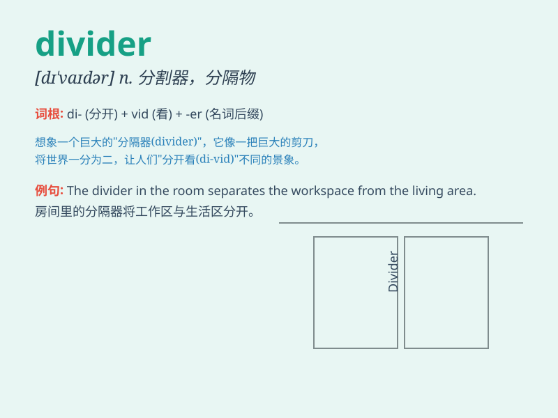

## divider

**英音:** _[dɪ\'vaɪdə]_ **美音:** _[dɪ\'vaɪdɚ]_

**译义:** *n.分割者,间隔物,分配器,园规*

### 短语

+ **voltage divider:** _分压器_

+ **partition divider:** _分区隔板_

+ **room divider:** _房间隔断_

+ **screen divider:** _屏风隔断_

+ **line divider:** _行分隔符_

### 例句

#### 例句1

> **The divider separated the room into two sections.**

**中文翻译:** 隔板将房间分成两部分。

**单词释义:** 分隔物；隔板

#### 例句2

> **She used a divider to organize her closet.**

**中文翻译:** 她用一个隔板来整理她的衣柜。

**单词释义:** 分隔板

#### 例句3

> **The road divider prevented cars from crossing into the opposite
lane.**

**中文翻译:** 道路分隔线阻止汽车进入对面车道。

**单词释义:** 分隔栏

### 背诵小故事

> A king needed a divider to split his kingdom evenly among his sons.
But finding the right divider proved difficult. Finally, a wise man
presented a perfect divider, and peace was restored.

**一位国王需要一个划分者来将他的王国平均分给儿子们。但找到合适的划分者很困难。最后，一位智者呈上了完美的划分工具，和平得以恢复。**

### 图义

