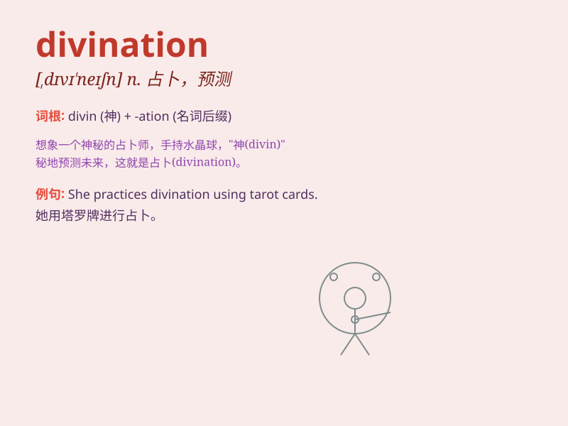

## divination

**英音:** _[,dɪvɪ\'neɪʃ(ə)n]_ **美音:** _[,dɪvɪ\'neʃən]_

**译义:** *n.预言*

### 短语

+ **crystal divination:** _水晶占卜_

+ **astrological divination:** _占星术占卜_

+ **divination by cards:** _纸牌占卜_

+ **divination ritual:** _占卜仪式_

+ **fortune-telling divination:** _算命占卜_

### 例句

#### 例句1

> **The ancient art of divination was practiced by many cultures to
predict the future.**

**中文翻译:** 许多文化都采用古老的占卜艺术来预测未来。

**单词释义:** 占卜；预测

#### 例句2

> **She had a deep interest in divination and spent hours studying
it.**

**中文翻译:** 她对占卜有着浓厚的兴趣，并花了几个小时研究它。

**单词释义:** 占卜；预言

#### 例句3

> **Divination through crystal balls was once considered a form of
magic.**

**中文翻译:** 通过水晶球进行占卜曾经被认为是一种魔法。

**单词释义:** 占卜；预测

### 背诵小故事

> A long time ago, a wise man used special tools and mysterious methods
for divination. He could predict the future and help people make
important decisions. It was like unlocking secrets hidden in the
unknown.

**很久以前，一位智者使用特殊的工具和神秘的方法进行占卜。他能够预测未来，帮助人们做出重要决定。这就像是解开隐藏在未知中的秘密。**

### 图义

