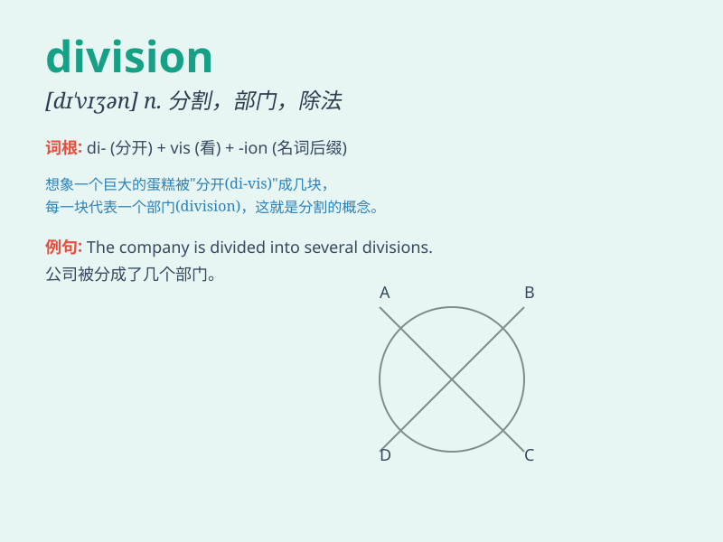

## division

**英音:** _[dɪ\'vɪʒ(ə)n]_ **美音:** _[də\'vɪʒən]_

**译义:** *n.分开,分割,区分,除法,公司,(军事)师,分配,分界线*

### 短语

+ **cell division:** _细胞分裂_

+ **division of labor:** _劳动分工_

+ **administrative division:** _行政区划_

+ **frequency division:** _频分_

+ **division sign:** _除号_

### 例句

#### 例句1

> **The company is undergoing a major division due to financial
problems.**

**中文翻译:** 由于财务问题，该公司正在进行重大分裂。

**单词释义:** 分裂；分开

#### 例句2

> **The division of labor in this factory is very clear.**

**中文翻译:** 这个工厂的分工非常明确。

**单词释义:** 分工

#### 例句3

> **The math problem involves complex division operations.**

**中文翻译:** 数学问题涉及复杂的除法运算。

**单词释义:** 除法；除（法）运算

### 背诵小故事

> In a big company, there was a division of labor. One team was in
charge of sales, another of marketing. This clear division made the
company run smoothly.

**在一家大公司里，存在着分工。一个团队负责销售，另一个负责市场营销。这种清晰的划分让公司运转顺畅。**

### 图义

