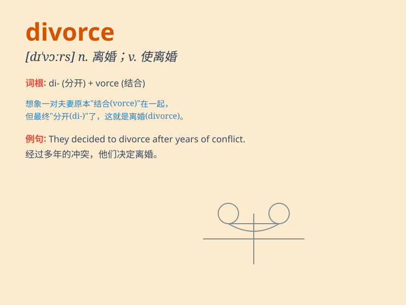

## divorce

**英音:** _[dɪ\'vɔːs]_ **美音:** _[dɪ\'vɔrs]_

**译义:** *n.离婚,脱离vt.使离婚,与\...脱离*

### 短语

+ **divorce settlement:** _离婚协议；离婚财产分割_

+ **divorce rate:** _离婚率_

+ **get a divorce:** _离婚_

+ **divorce proceedings:** _离婚诉讼_

+ **divorce court:** _离婚法庭_

### 例句

#### 例句1

> **They decided to get a divorce after years of marital
problems.**

**中文翻译:** 经过多年的婚姻问题，他们决定离婚。

**单词释义:** 离婚

#### 例句2

> **The divorce rate has been increasing in recent years.**

**中文翻译:** 近年来，离婚率不断上升。

**单词释义:** 离婚

#### 例句3

> **She filed for divorce from her husband.**

**中文翻译:** 她向丈夫提出离婚。

**单词释义:** 离婚

### 背诵小故事

> A couple was very unhappy. They had many fights and couldn\'t stand
each other anymore. Finally, they decided to divorce, meaning they ended
their marriage and went their separate ways.

**一对夫妻非常不开心。他们争吵不断，再也无法忍受彼此。最终，他们决定离婚，这意味着他们结束了婚姻，各走各的路。**

### 图义

