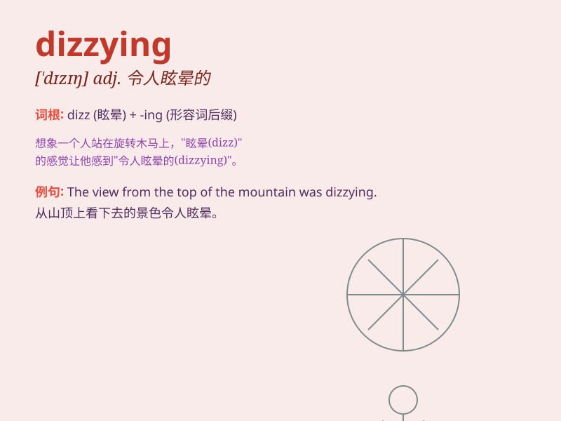

## dizzying

**英音:** _[\'dɪziːɪŋ]_ **美音:** _[\'dɪzɪɪŋ]_

**译义:** *adj.令人昏乱的,灿烂的*

### 短语

+ **dizzying speed:** _令人眩晕的速度_

+ **dizzying height:** _令人眩晕的高度_

+ **dizzying array:** _令人眼花缭乱的排列_

+ **dizzying choice:** _令人眼花缭乱的选择_

+ **dizzying success:** _令人目眩的成功_

### 例句

#### 例句1

> **The view from the top of the skyscraper was dizzying.**

**中文翻译:** 从摩天大楼顶部看到的景色令人目不暇接。

**单词释义:** 令人头晕目眩的

#### 例句2

> **The speed of technological change is dizzying.**

**中文翻译:** 技术变革的速度令人目眩。

**单词释义:** 令人眼花缭乱的

#### 例句3

> **The dizzying array of choices at the supermarket confused me.**

**中文翻译:** 超市里琳琅满目的选择让我眼花缭乱。

**单词释义:** 令人眼花缭乱的

### 背诵小故事

> A brave climber reached the top of a very tall mountain. When he
looked down, the height was so dizzying that he felt his head spin. It
was a view that made him feel unsteady and confused.

**一位勇敢的登山者到达了一座非常高的山的山顶。当他向下看时，高度令人眩晕，以至于他觉得头晕目眩。这是一个让他感到不稳定和困惑的景象。**

### 图义

