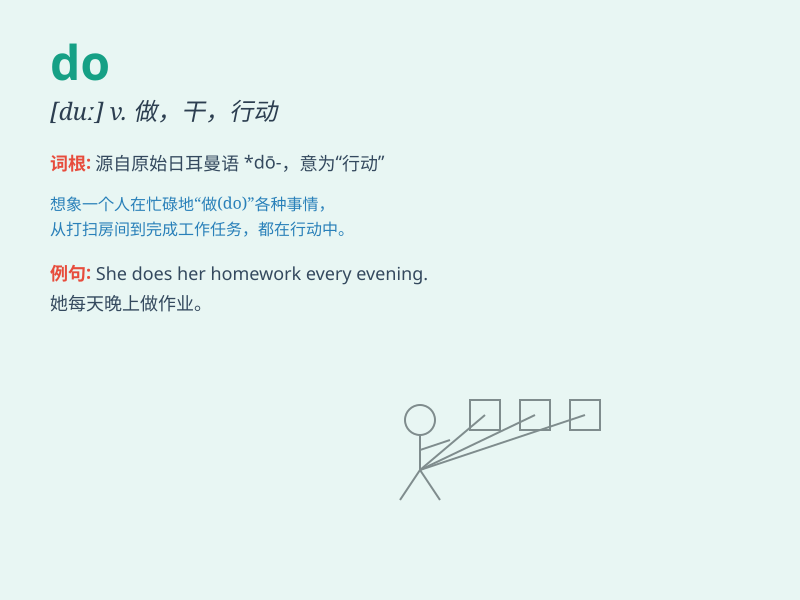

## do

**英音:** _[duː]_ **美音:** _[du]_

**译义:** *v.做,实行,尽力,给予,可用,制作,算出,解答 [域] Dominican
Republic ,多米尼加共和国*

### 短语

+ **do well:** _做得好；进展好_

+ **do one\'s best:** _竭尽全力；尽力而为_

+ **do harm to:** _对\...有害_

+ **do business:** _做生意；经商_

+ **do exercise:** _做运动；锻炼_

### 例句

#### 例句1

> **I do my homework every day.**

**中文翻译:** 我每天都做作业。

**单词释义:** 做

#### 例句2

> **What do you do for a living?**

**中文翻译:** 你靠什么谋生？

**单词释义:** 从事

#### 例句3

> **She does well in math.**

**中文翻译:** 她数学成绩很好。

**单词释义:** 表现；进展

### 背诵小故事

> One day, Tom had a lot of tasks to do. He needed to do his homework,
do the dishes and do the laundry. But he didn\'t complain and just did
them one by one.

**一天，汤姆有很多任务要做。他需要做作业、洗碗和洗衣服。但他没有抱怨，只是一个接一个地做。**

### 图义

