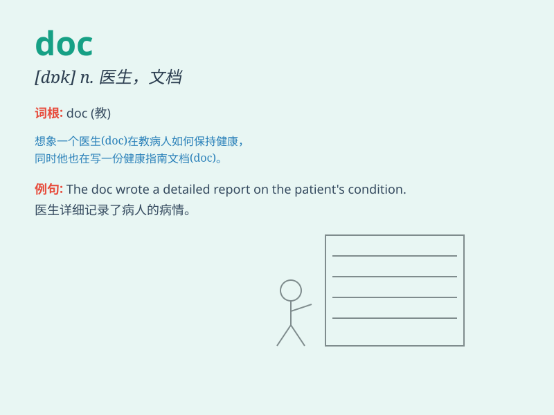

## doc

**英音:** _[dɒk]_ **美音:** _[dɑːk]_

**译义:** *n.医生；博士；文件；v.篡改；伪造*

### 短语

+ **doc file:** _文档文件_

+ **doc martens:** _马汀博士鞋（品牌）_

+ **doc string:** _文档字符串（编程术语）_

+ **doc patient:** _耐心的医生_

+ **doc holiday:** _（人名）多克·霍利迪_

### 例句

#### 例句1

> **The doctor prescribed some medicine for my cold.**

**中文翻译:** 医生给我开了一些治感冒的药。

**单词释义:** 医生

#### 例句2

> **I need to see a doc as soon as possible.**

**中文翻译:** 我需要尽快看医生。

**单词释义:** 医生

#### 例句3

> **The doc examined the patient carefully.**

**中文翻译:** 这位医生仔细地给病人做了检查。

**单词释义:** 医生

### 背诵小故事

> One day, a little monkey was lost in the forest. Luckily, a kind DOC
(doctor) appeared and helped the monkey find its way home. The monkey
was very grateful to the DOC.

**有一天，一只小猴子在森林里迷路了。幸运的是，一位善良的医生出现了，帮助猴子找到了回家的路。猴子非常感激这位医生。**

### 图义

