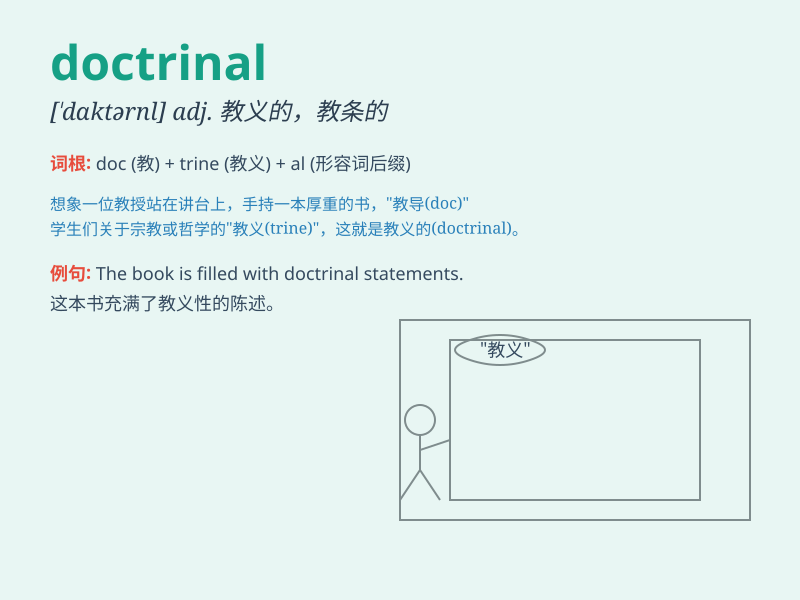

## doctrinal

**英音:** _[dɒkˈtraɪnl]_ **美音:** _[ˈdɑːktrənl]_

**译义:** *adj.学说的*

### 短语

+ **doctrinal belief:** _教义上的信仰_

+ **doctrinal statement:** _教义声明_

+ **doctrinal system:** _教义体系_

+ **doctrinal controversy:** _教义争议_

+ **doctrinal approach:** _教义方法_

### 例句

#### 例句1

> **The professor\'s lecture was highly doctrinal, focusing on
theoretical concepts.**

**中文翻译:** 这位教授的讲座非常教条，专注于理论概念。

**单词释义:** 教条的；教义的

#### 例句2

> **The church\'s stance on this issue is quite doctrinal.**

**中文翻译:** 教会在这个问题上的立场相当教义化。

**单词释义:** 教义的；学说的

#### 例句3

> **His approach to the problem was too doctrinal and lacked
practicality.**

**中文翻译:** 他处理这个问题的方法太教条，缺乏实用性。

**单词释义:** 教条式的

### 背诵小故事

> A young scholar was lost in a forest. Suddenly, he met an old wise
man who gave him doctrinal advice on how to find the way out. The
scholar followed the wise words and successfully escaped. The advice was
like guiding principles.

**一位年轻的学者在森林中迷路了。突然，他遇到了一位年长的智者，智者给了他一些学说性的建议，告诉他如何走出森林。学者听从了这些明智的话，成功逃脱了。这些建议就像是指导性的原则。**

### 图义

