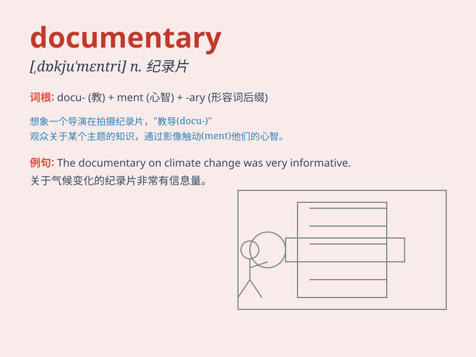

## documentary

**英音:** _[dɒkjʊ\'ment(ə)rɪ]_ **美音:**
_[\'dɑkjə\'mɛntri]_

**译义:** *n.记录片adj.文件的 纪录片 记录片,文献片*

### 短语

+ **documentary film:** _纪录片电影_

+ **documentary evidence:** _书面证据_

+ **documentary credit:** _跟单信用证_

+ **documentary collection:** _跟单托收_

+ **make a documentary:** _制作纪录片_

### 例句

#### 例句1

> **I watched an interesting documentary about wildlife last
night.**

**中文翻译:** 昨晚我看了一部关于野生动物的有趣的纪录片。

**单词释义:** 纪录片

#### 例句2

> **The documentary provides valuable insights into historical
events.**

**中文翻译:** 这部纪录片为历史事件提供了宝贵的见解。

**单词释义:** 纪录片

#### 例句3

> **She is making a documentary on environmental protection.**

**中文翻译:** 她正在制作一部关于环境保护的纪录片。

**单词释义:** 纪录片

### 背诵小故事

> One day, I was looking for interesting things to watch. Then I found
a documentary about wild animals. It showed their lives and how they
survive. I was so amazed and learned a lot from this documentary.

**有一天，我在找有趣的东西看。然后我发现了一部关于野生动物的纪录片。它展示了它们的生活以及如何生存。我非常惊讶，并从这部纪录片中学到了很多。**

### 图义

