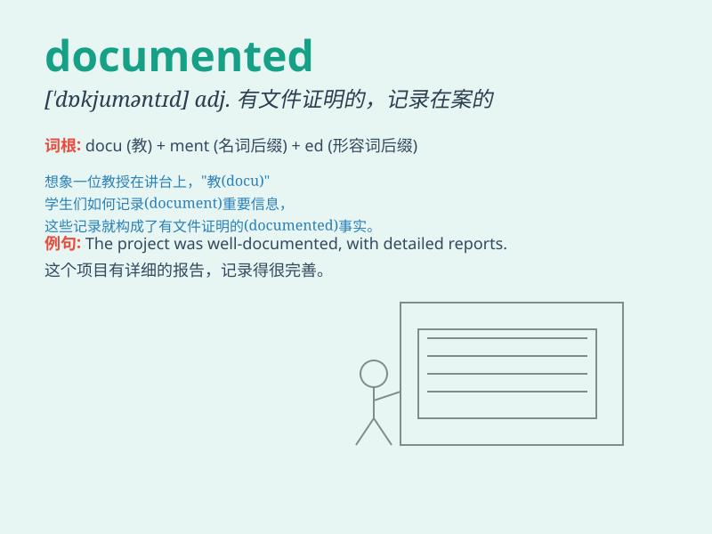

## documented

**英音:** _[ˈdɒkjʊməntɪd]_ **美音:** _[ˈdɑːkjəməntɪd]_

**译义:** *adj.有文件的；有记录的；有证据的；有记载的*

### 短语

+ **well documented:** _有大量文件记载的；有充分文献证明的_

+ **poorly documented:** _文献记载少的；记录不充分的_

+ **documented evidence:** _书面证据；有记录的证据_

+ **documented history:** _有记载的历史_

+ **documented case:** _有记录的案例_

### 例句

#### 例句1

> **The historical event is well documented.**

**中文翻译:** 这个历史事件有详尽的文献记载。

**单词释义:** 有文献记载的

#### 例句2

> **Her illness has been documented by the doctor.**

**中文翻译:** 她的病情已被医生记录在案。

**单词释义:** 记录；记载

#### 例句3

> **The journey was fully documented in his diary.**

**中文翻译:** 这次旅行在他的日记中被完整地记录了下来。

**单词释义:** 用文件证明（或记录）

### 背诵小故事

> A detective was looking for clues. He found many documented papers
that recorded important information. These documented records helped him
solve the mystery.

**一位侦探正在寻找线索。他发现了许多有记录的文件，这些文件记录了重要的信息。这些有记录的文件帮助他解开了谜团。**

### 图义

