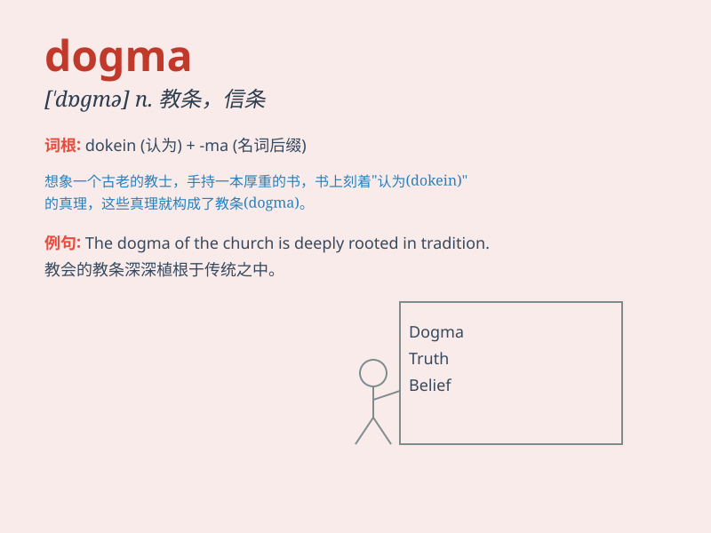

## dogma

**英音:** _[\'dɒgmə]_ **美音:** _[\'dɔɡmə]_

**译义:** *n.教条*

### 短语

+ **religious dogma:** _宗教教义_

+ **political dogma:** _政治信条_

+ **break away from dogma:** _摆脱教条_

+ **blindly follow dogma:** _盲目遵循教条_

+ **challenge dogma:** _挑战教条_

### 例句

#### 例句1

> **The church\'s dogma is based on ancient scriptures.**

**中文翻译:** 教会的教义基于古老的经文。

**单词释义:** 教义

#### 例句2

> **He refused to accept the dogma of his political party without
question.**

**中文翻译:** 他拒绝毫无疑问地接受他所在政党的信条。

**单词释义:** 信条

#### 例句3

> **The scientist challenged the old dogma and proposed a new
theory.**

**中文翻译:** 这位科学家挑战了旧的教条并提出了一个新的理论。

**单词释义:** 教条

### 背诵小故事

> A little dog was lost and met a wise old owl. The owl said, \'Don\'t
follow dogma blindly; find your own way home.\' So the dog explored and
finally found its way. Remember, dogma means a set of beliefs that are
accepted without question.

**一只小狗迷路了，遇到了一只聪明的老猫头鹰。猫头鹰说：'不要盲目遵循教条；找到自己回家的路。'于是小狗去探索，最终找到了家。记住，dogma
指的是被毫无疑问接受的一套信条。**

### 图义

