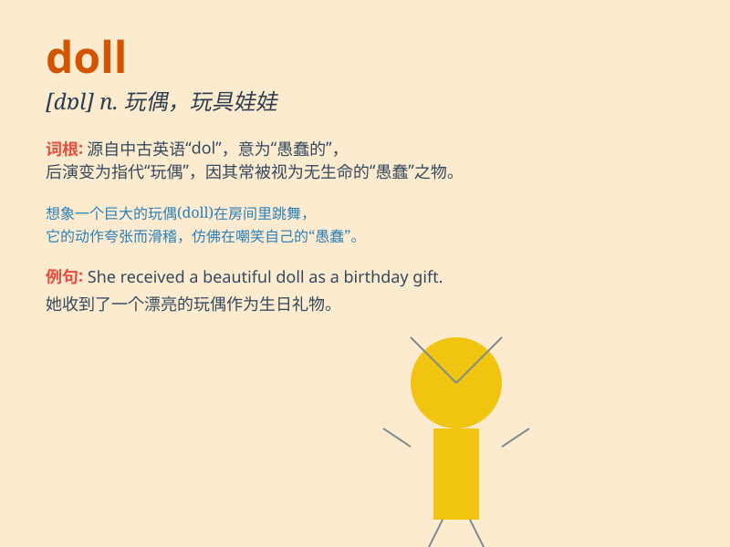

## doll

**英音:** _[dɒl]_ **美音:** _[dɑl]_

**译义:** *n.洋娃娃,玩偶,美丽但无头脑的女子,\<俚>美男子*

### 短语

+ **doll up:** _精心打扮_

+ **paper doll:** _纸娃娃_

+ **rag doll:** _布娃娃；碎布制玩偶_

+ **doll house:** _玩具屋；玩偶之家_

+ **baby doll:** _婴儿娃娃；娃娃装_

### 例句

#### 例句1

> **The little girl was playing with her doll.**

**中文翻译:** 小女孩正在玩她的洋娃娃。

**单词释义:** 洋娃娃

#### 例句2

> **She collects antique dolls.**

**中文翻译:** 她收集古董娃娃。

**单词释义:** 玩偶

#### 例句3

> **The doll\'s dress was beautifully made.**

**中文翻译:** 娃娃的衣服做得很漂亮。

**单词释义:** 洋娃娃

### 背诵小故事

> A little girl named Lily lost her favorite doll. She was very sad.
But her parents found it and gave it back to her. Lily was so happy and
hugged the doll tightly. The doll was always her good friend.

**一个叫莉莉的小女孩弄丢了她最喜欢的玩偶。她非常伤心。但她的父母找到了并还给了她。莉莉非常开心，紧紧地抱住了玩偶。这个玩偶一直是她的好朋友。**

### 图义

