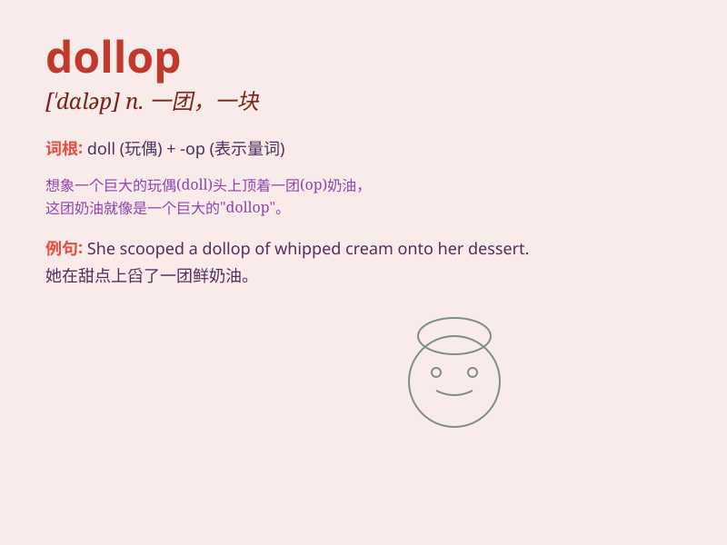

## dollop

**英音:** _[\'dɒləp]_ **美音:** _[\'dɑləp]_

**译义:** *n.块,团*

### 短语

+ **a dollop of cream:** _一团奶油_

+ **a dollop of jam:** _一勺果酱_

+ **a dollop of butter:** _一块黄油_

+ **a dollop of whipped cream:** _一团掼奶油_

+ **a dollop of yogurt:** _一勺酸奶_

### 例句

#### 例句1

> **She added a dollop of cream to her coffee.**

**中文翻译:** 她在咖啡里加了一点奶油。

**单词释义:** 一团，一块（通常指软的物质）

#### 例句2

> **He put a dollop of mustard on his hot dog.**

**中文翻译:** 他在热狗上放了一块芥末。

**单词释义:** 少量，一点儿

#### 例句3

> **The chef added a dollop of butter to the pan.**

**中文翻译:** 厨师在锅里加了一块黄油。

**单词释义:** 一块（黄油等）

### 背诵小故事

> One day, a little girl was very sad because she lost her doll. But
then, a kind fairy appeared and gave her a dollop of magic powder. The
powder turned into a new doll, and the girl was happy again.

**有一天，一个小女孩非常伤心，因为她丢了她的洋娃娃。但随后，一位善良的仙女出现了，给了她一团神奇的粉末。粉末变成了一个新的洋娃娃，小女孩又开心起来了。**

### 图义

