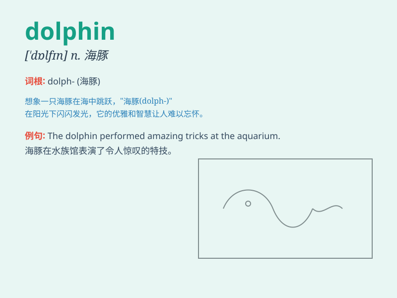

## dolphin

**英音:** _[\'dɒlfɪn]_ **美音:** _[\'dɑlfɪn]_

**译义:** *n.海豚*

### 短语

+ **bottlenose dolphin:** _宽吻海豚_

+ **dolphin show:** _海豚表演_

+ **dolphin trainer:** _海豚训练员_

+ **dolphin sighting:** _看到海豚_

+ **dolphin pod:** _海豚群_

### 例句

#### 例句1

> **The dolphin jumped out of the water and performed a beautiful
trick.**

**中文翻译:** 海豚跃出水面，表演了一个美丽的把戏。

**单词释义:** 海豚

#### 例句2

> **We saw a group of dolphins swimming in the ocean.**

**中文翻译:** 我们看到一群海豚在海里游泳。

**单词释义:** 海豚

#### 例句3

> **The dolphin is known for its intelligence and friendly
nature.**

**中文翻译:** 海豚以其聪明和友善的天性而闻名。

**单词释义:** 海豚

### 背诵小故事

> One day, a little boy was playing by the sea. Suddenly, a dolphin
jumped out of the water and danced happily. The boy was so excited and
shouted, \'Look, it\'s a dolphin!\' The dolphin was so cute and
friendly.

**一天，一个小男孩在海边玩耍。突然，一只海豚跳出水面欢快地跳舞。小男孩非常兴奋，大喊：'看，是海豚！'这只海豚非常可爱和友好。**

### 图义

