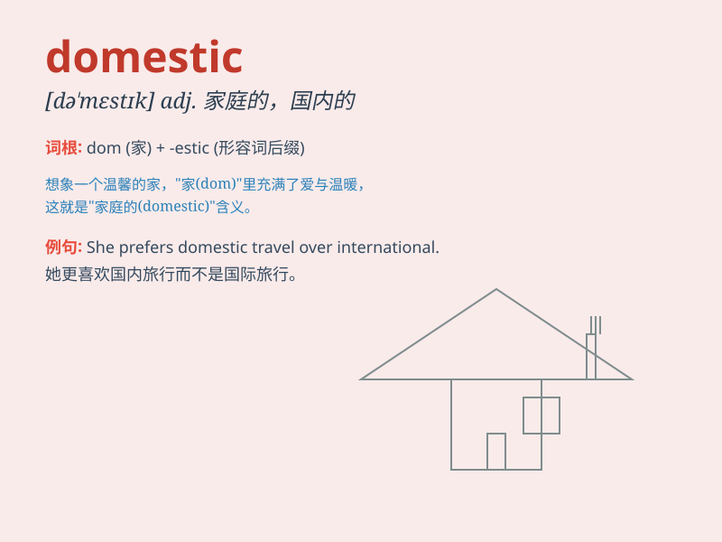

## domestic

**英音:** _[də\'mestɪk]_ **美音:** _[də\'mɛstɪk]_

**译义:** *adj.家庭的,国内的,与人共处的,驯服的*

### 短语

+ **domestic market:** _国内市场_

+ **domestic violence:** _家庭暴力_

+ **domestic product:** _国产产品_

+ **domestic helper:** _家庭帮佣_

+ **domestic affairs:** _内政；国内事务_

### 例句

#### 例句1

> **She is very good at domestic affairs.**

**中文翻译:** 她非常擅长处理家庭事务。

**单词释义:** 家庭的；家务的

#### 例句2

> **The company focuses on the domestic market.**

**中文翻译:** 公司专注于国内市场。

**单词释义:** 国内的

#### 例句3

> **Domestic violence is a serious social problem.**

**中文翻译:** 家庭暴力是一个严重的社会问题。

**单词释义:** 家庭的；家用的

### 背诵小故事

> A man had a pet dog. The dog always stayed at home, was friendly to
family members, and helped with simple tasks. This dog was domestic,
meaning it was related to home and family life.

**一个男人有一只宠物狗。这只狗总是待在家里，对家庭成员很友好，还帮忙做一些简单的事。这只狗是家养的，意味着它与家庭生活有关。**

### 图义

