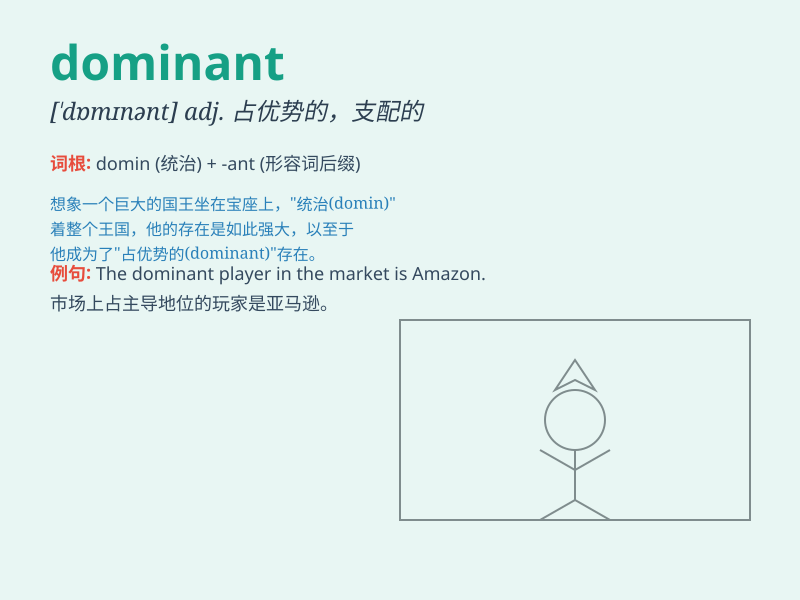

## dominant

**英音:** _[\'dɒmɪnənt]_ **美音:** _[\'dɑmɪnənt]_

**译义:** *adj.有统治权的,占优势的,支配的adj.[生物] 显性的*

### 短语

+ **dominant position:** _优势地位；支配地位_

+ **dominant gene:** _显性基因_

+ **dominant force:** _主导力量_

+ **dominant theme:** _主导主题_

+ **dominant culture:** _主流文化_

### 例句

#### 例句1

> **The male lion is the dominant animal in the pride.**

**中文翻译:** 雄狮是狮群中的主要动物。

**单词释义:** 占主导地位的；占优势的

#### 例句2

> **Blue is the dominant color in this painting.**

**中文翻译:** 蓝色是这幅画的主色调。

**单词释义:** 主要的；显著的

#### 例句3

> **The dominant feature of the landscape is the mountain range.**

**中文翻译:** 景观的主要特征是山脉。

**单词释义:** 突出的；显著的

### 背诵小故事

> In a forest, there was a huge and powerful lion. It was always the
dominant one, leading the other animals. Its roar could make all
tremble. The lion\'s dominance was unquestionable.

**在一片森林里，有一只体型巨大且强大的狮子。它总是占主导地位，领导着其他动物。它的吼声能让所有动物颤抖。狮子的主导地位毋庸置疑。**

### 图义

