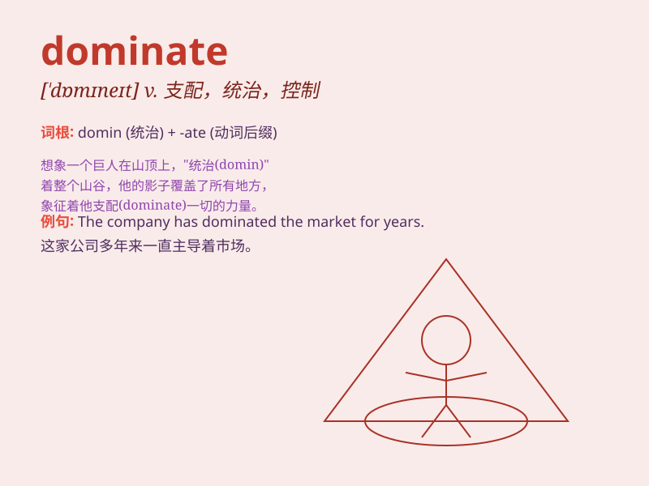

## dominate

**英音:** _[\'dɒmɪneɪt]_ **美音:** _[\'dɑmɪnet]_

**译义:** *v.支配,占优势*

### 短语

+ **dominate the market:** _主导市场_

+ **dominate the conversation:** _主导谈话_

+ **dominate the game:** _主宰比赛_

+ **dominate the scene:** _占据主导地位_

+ **dominate the field:** _在该领域占优势_

### 例句

#### 例句1

> **The skyscraper dominates the city skyline.**

**中文翻译:** 摩天大楼主导着城市的天际线。

**单词释义:** 在\...中占主导地位

#### 例句2

> **He has always dominated the discussions with his strong
opinions.**

**中文翻译:** 他总是以自己的强硬观点主导讨论。

**单词释义:** 主导

#### 例句3

> **The team\'s star player dominated the game and scored several
goals.**

**中文翻译:** 球队的明星球员主宰了比赛并打进了多个进球。

**单词释义:** 支配；控制

### 背诵小故事

> In a fierce battle of wits, the intelligent and strong-willed king
was able to dominate the entire field. His strategies and power made all
his enemies submit. No one could challenge his dominance.

**在一场激烈的智谋之战中，聪明且意志坚强的国王得以主宰整个战场。他的策略和力量让所有敌人屈服。无人能挑战他的统治地位。**

### 图义

