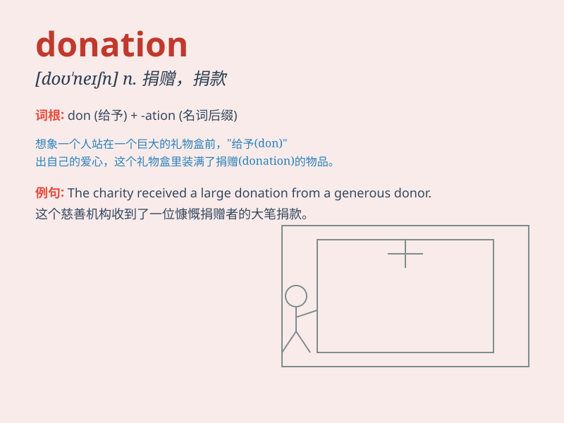

## donation

**英音:** _[də(ʊ)\'neɪʃ(ə)n]_ **美音:** _[do\'neʃən]_

**译义:** *n.捐赠品,捐款,贡献*

### 短语

+ **make a donation:** _进行捐赠_

+ **charitable donation:** _慈善捐赠_

+ **blood donation:** _献血_

+ **donation box:** _捐款箱_

+ **receive a donation:** _收到捐赠_

### 例句

#### 例句1

> **The charity received a large donation from a generous donor.**

**中文翻译:** 该慈善机构收到了一位慷慨捐助者的巨额捐款。

**单词释义:** 捐款

#### 例句2

> **We are grateful for every donation, no matter how small.**

**中文翻译:** 我们对每一次捐款表示感谢，无论数额多小。

**单词释义:** 捐赠；捐献

#### 例句3

> **The hospital relies on public donations to buy new equipment.**

**中文翻译:** 该医院依靠公众捐款购买新设备。

**单词释义:** 捐赠物；捐赠款

### 背诵小故事

> One day, a poor family was in trouble. Many kind people made
donations to help them. The donations included food, clothes and money.
With these donations, the family\'s life became better.

**一天，一个贫困家庭陷入困境。许多善良的人进行捐赠来帮助他们。捐赠的物品包括食物、衣服和钱。凭借这些捐赠，这个家庭的生活变得更好了。**

### 图义

